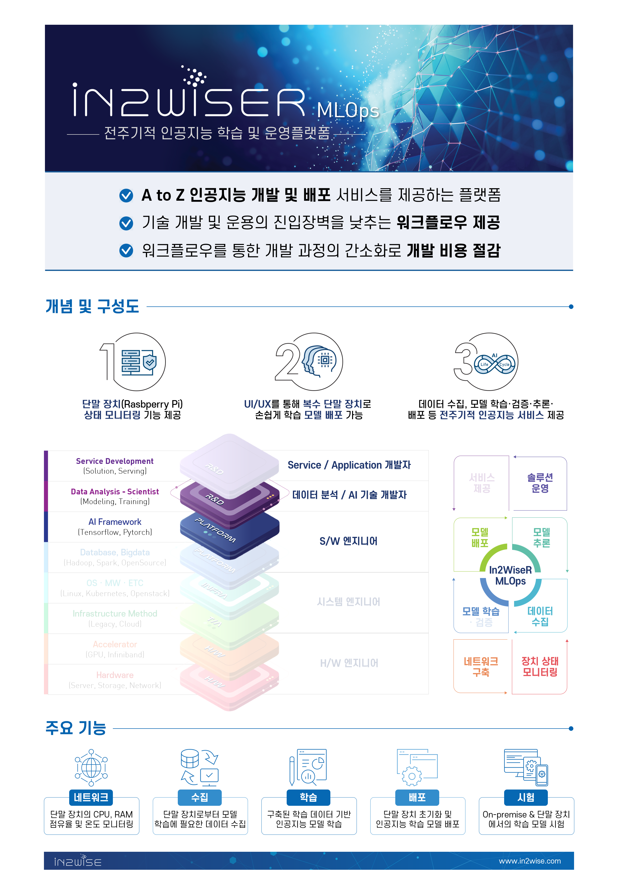

# In2WiseR MLOps

## 전주기적 인공지능 학습 및 운영플랫폼
 - In2WiseR MLOps는 단일 인공지능 솔루션 개발의 전주기를 수행할 수 있는 웹 도구입니다. 
 - 코드 개발, 수정 등 소프트웨어 개발을 최소화함으로써 노코드 플랫폼을 지향합니다.
 - 명칭 입력, 버튼 클릭 등 기본적인 입력 및 UI 컨트롤만으로  
 단말 장치 상태 확인, 데이터 수집, 인공지능 모델 학습, 인공지능 모델 배포를 수행 할 수 있습니다.

## 리플렛
  
  

## 목차



## 공급자


