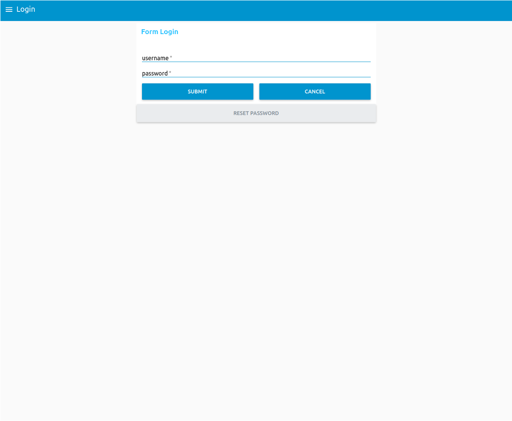
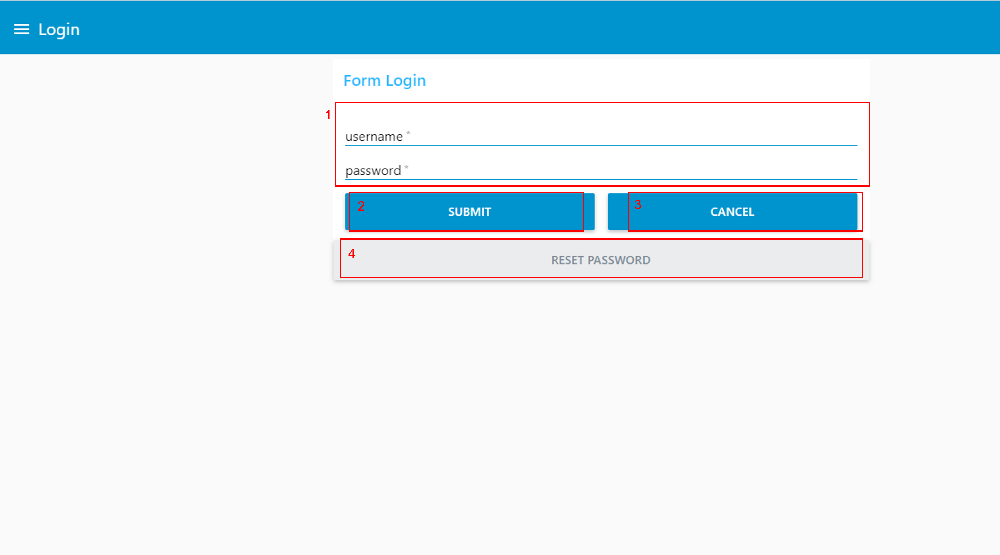
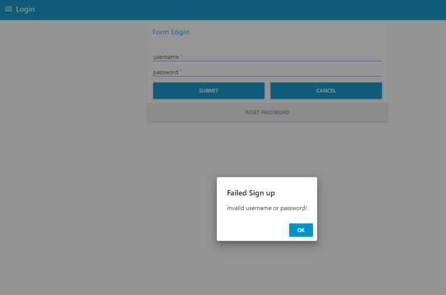
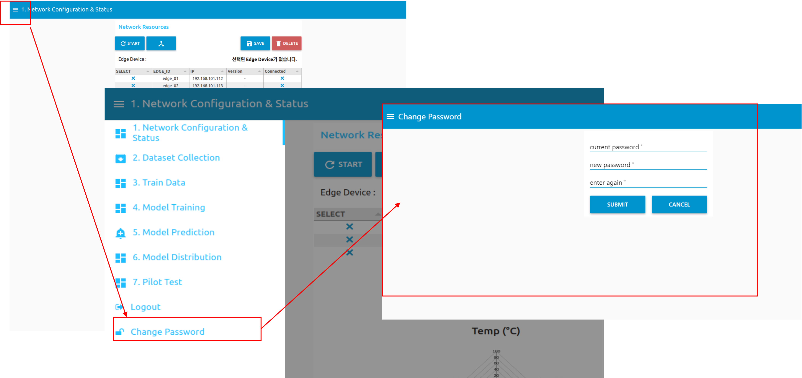
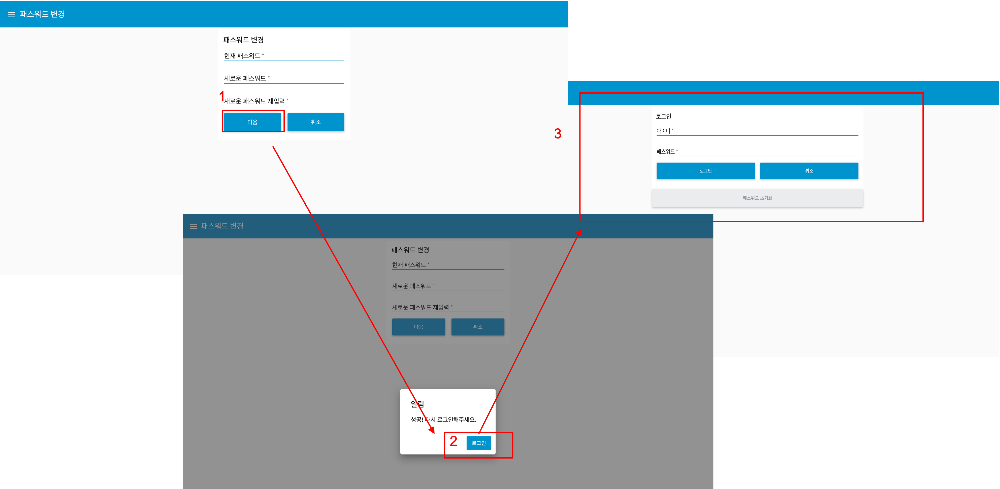
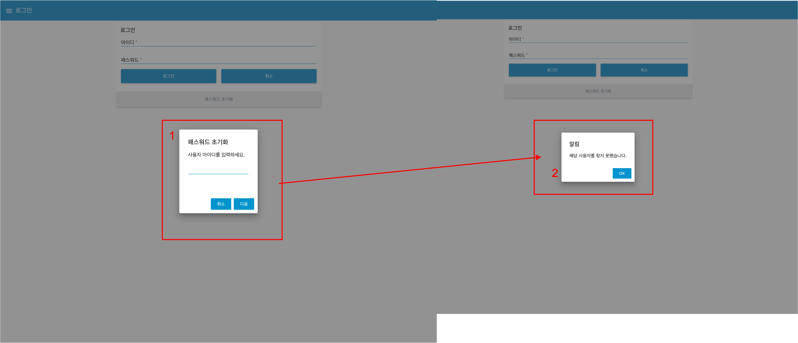
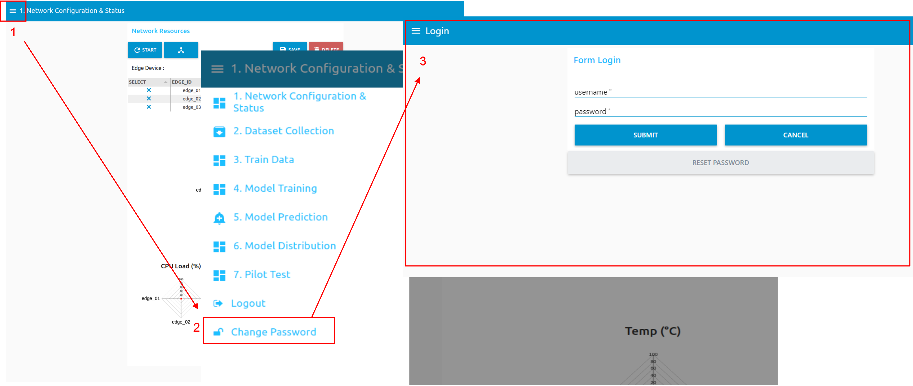

---

sort: 1

---

# 사용자 관리

---

## 로그인

학습플랫폼을 이용하기 위해 로그인이 필요하다. 

  

1. 첫 화면에는 아이디와 패스워드를 입력하는 란이 포함된 Login 화면이 표출된다.
2. 아이디와 패스워드를 입력하면, 첫번째 탭 화면으로 이동된다.

  
  
  
  
1.아이디와 패스워드입력란 : 아이디와 패스워드를 입력한다. 
2.로그인 버튼 : 아이디, 패스워드를 입력 후, 로그인 버튼을 누른다. 만약 입력한 정보가 맞지 않다면 아래 화면과 같은 "사용자 아이디 또눈 비밀번호가 일치하지 않습니다." 문구를 포함한 알림창이 표출된다. 
   
   
   
3.취소 버튼 : 작성한 아이디와 패스워드가 초기화 된다.  
4.패스워드 초기화 버튼 : 비밀번호 초기화를 진행한다.
   * 영어 대소문자 4~20자, 특수문자(!@#$%^&*()) 1개 이상

**※ 보안상의 이유로 하나의 IP, 하나의 웹 페이지에서 로그인 상태를 활성화 할 수 있습니다.**
**동일한 IP 내 다른 웹 페이지에서 로그인을 시도할 경우 중복 로그인 정책에 따라 강제 로그아웃되며, 비밀번호 노출 의심시 비밀번호를 변경해주시기 바랍니다.**

  

## 비밀번호 변경

비밀번호를 변경하기 위해서는 로그인을 한 상태에서, 아래 화면과 같이, 왼쪽 상단 탭을 선택 후, 패스워드 변경을 선택하여, 진행한다. 

  

비밀번호 변경은 아래와 같이 진행된다. 

  

1. 현재 패스워드, 새로운 패스워드, 새로운 패스워드 재입력을 입력한 후, 다음 버튼을 선택한다. 만약 아래와 같은 상황들은 에러 메세지가 나타나고 변경되지 않는다.
   * 현재 비밀번호가 다른 경우
   * 새로운 비밀번호가 다른 경우
   * 새로운 비밀번호에 특수문자가 포함되지 않은 경우
   * 영어 대소문자 4~20자, 특수문자(!@#$%^&*()) 1개 이상

2. 성공적으로 변경이 됐으면, "성공! 다시 로그인해주세요." 문구를 포함한 알림 창이 뜨고, 로그인 버튼을 선택한다.
3. 로그인 화면에서 변경된 비밀번호를 통해 다시 로그인한다.

  

## 비밀번호 초기화

로그인 화면에서 하단 패스워드 초기화 를 선택하면, 비밀번호를 초기화할 수 있다. 비밀번호 초기화를 완료하면, 사전에 등록한 이메일로 메일이 전송되며, 
전송된 메일을 확인 후, 로그인이 가능하다. 

  

1. "사용자 아이디를 입력하세요." 입력란에 아이디를 입력한 후, 다음 버튼을 선택한다. 취소 선택 시, 비밀번호 초기화 진행이 취소된다.
2. "새로운 패스워드를 메일로 전송했습니다." 문구를 포함한 알림 창이 표출되며, 사전에 등록한 이메일로 메일이 전송된다.

만약 사용자 아이디를 잘못입력하면 아래와 같이 "해당 사용자를 찾지 못했습니다." 문구를 포함한 알림 창이 표출된다.

  

  

## 로그아웃

로그아웃은 왼쪽 상단 탭 선택 후, 로그아웃을 선택하여 진행한다. 로그아웃 시, 로그인 화면으로 돌아간다. 

  

1. 왼쪽 상단 탭을 선택한다. 
2. 탭목록에서 로그아웃을 선택한다.
3. 로그아웃 시, 로그인 화면으로 돌아간다.

  

**※ 본 문서에 안내 된 알림을 제외한 문제가 발생할 경우, 알림 창 안내에따라 구매처로 문의하시기 바랍니다.**

