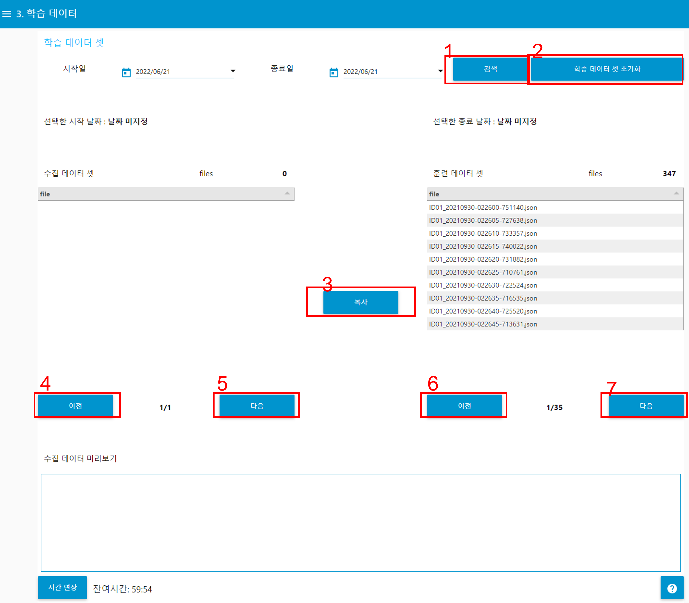
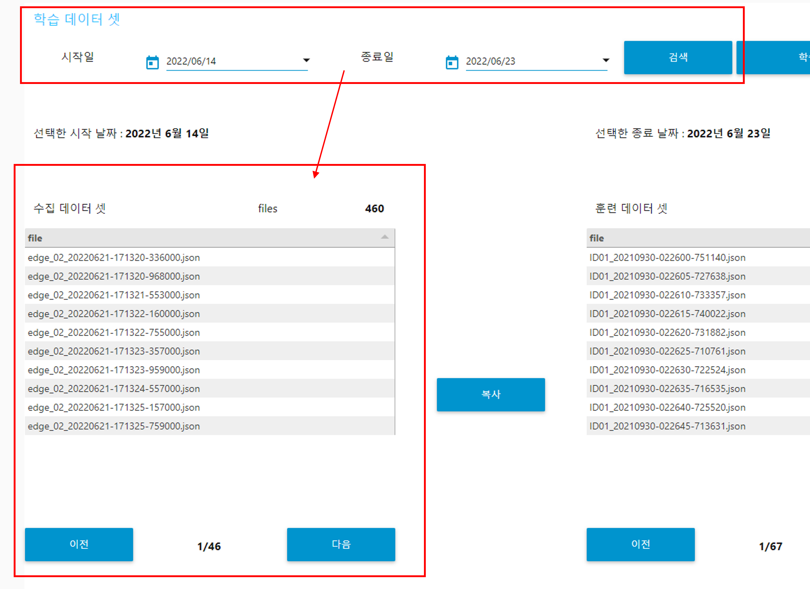
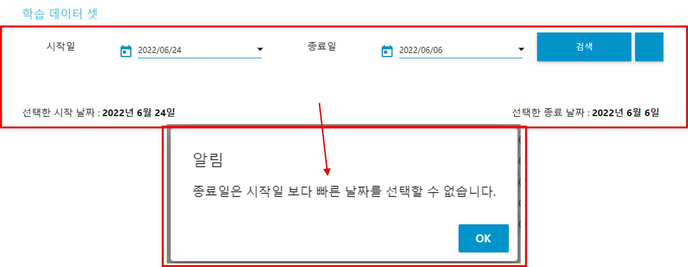
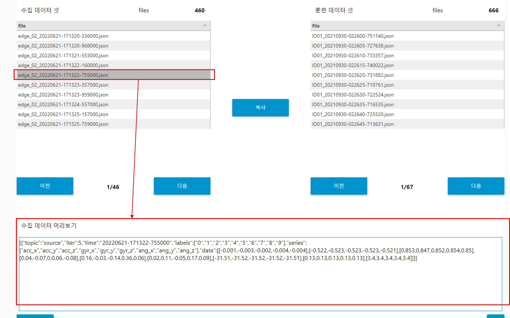
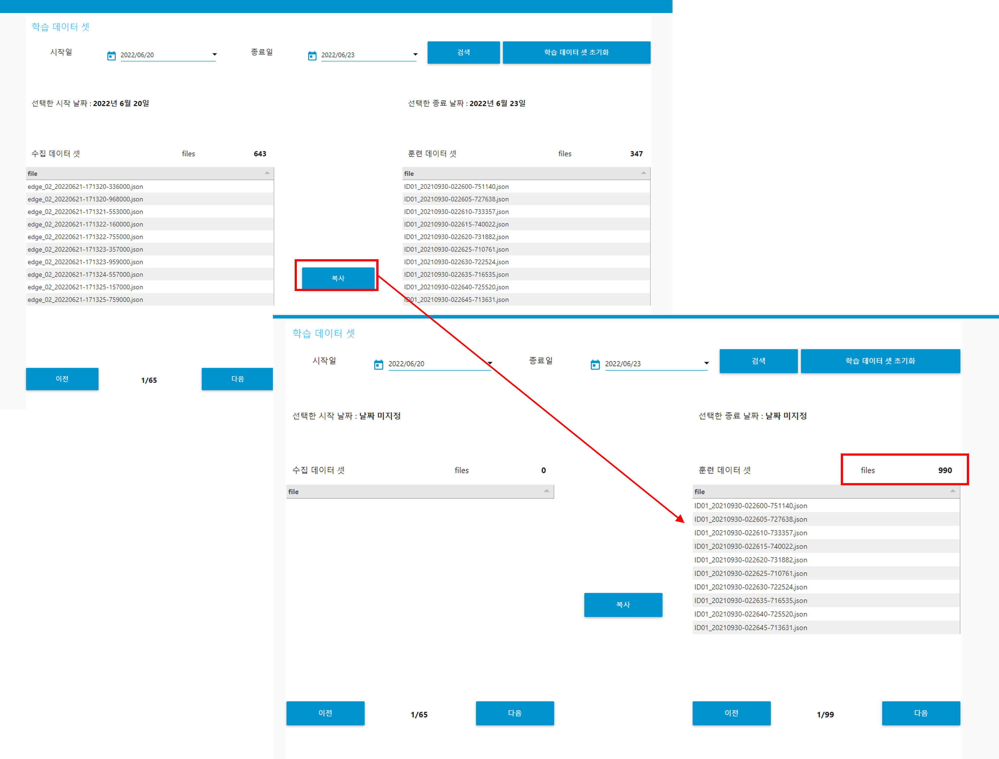
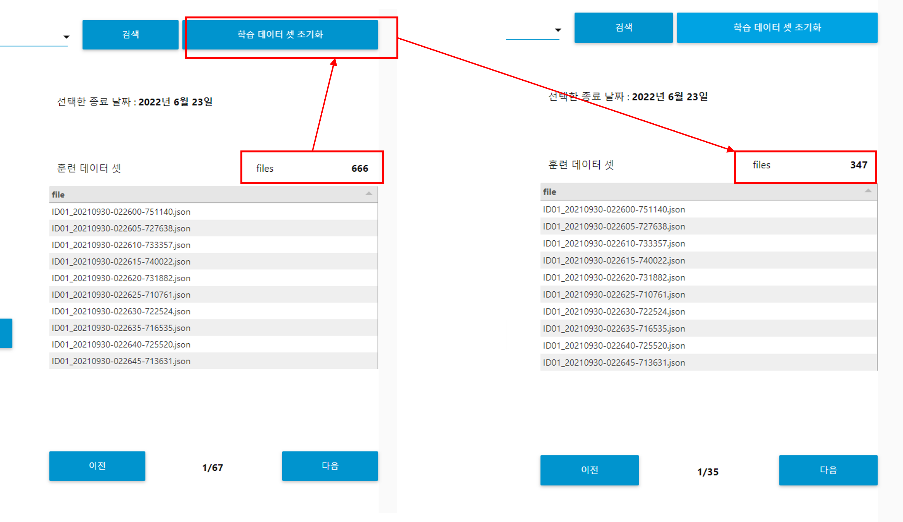

---

sort: 4

---

# 학습 데이터

수집된 데이터는 날짜 기준으로 필터링하여, 훈련용 데이터셋으로 복사한다. 훈련용 데이터셋에 있는 데이터들은 모델을 학습하는데 사용된다. 

1. 검색: 시작일, 종료일을 선택한 후 검색버튼을 누르면, 해당 기간에 수집된 데이터가 수집 데이터 셋에 표출된다.
2. 학습 데이터 셋 초기화: 훈련 데이터 셋을 초기화한다. 훈련 데이터 셋은 기본적으로 347개의 데이터 셋을 제공한다.
3. 복사: 수집 데이터 셋에 있는 데이터 파일들을 훈련 데이터 셋에 복사한다.
4. 이전(수집 데이터 셋): 수집 데이터 셋에 있는 파일들의 이전 리스트를 확인한다.
5. 다음(수집 데이터 셋): 수집 데이터 셋에 있는 파일들의 다음 리스트를 확인한다.
6. 이전(훈련 데이터 셋): 훈련 데이터 셋에 있는 파일들의 이전 리스트를 확인한다.
7. 다음(훈련 데이터 셋): 훈련 데이터 셋에 있는 파일들의 다음 리스트를 확인한다.

  

## 날짜를 이용하여, 수집된 데이터 필터링

날짜를 이용하여, 수집된 데이터를 필터링하기 위해서는 반드시 시작일과 종료일을 선택해야 한다. 

시작일과 종료일을 선택하고, 검색 버튼을 누르면, 선택한 기간에 해당하는 데이터들이 수집 데이터 셋에 표출된다. 
※ 시작일 또는 종료일을 선택하면, 하단에 "선택한 시작 날짜", "선택한 종료 날짜"에 선택한 날짜가 표출된다.  
**※ 데이터 양에 따라서 조회하는데 걸리는 시간이 증가할 수 있습니다.**

  

시작일과 종료일 선택하지 않고, 검색 버튼을 누르면, "시작일, 종료일을 선택해 주세요" 메시지가 표출된다.  

시작일이 종료일 보다 이후일 경우, "종료일은 시작일 보다 빠른 날짜를 선택할 수 없습니다." 메시지가 표출된다.  

  

## 수집된 데이터 내용 확인

수집 데이터 셋에 표출된 데이터를 선택하면, "수집 데이터 미리보기" 통해, 수집된 데이터 내용 일부를 확인할 수 있다.

  

## 훈련용 데이터로 복사

복사 버튼을 선택하면, 수집 데이터 셋에 있는 데이터 파일들이 훈련 데이터 셋으로 복사된다.

  

## 훈련용 데이터 초기화

학습 데이터 셋 초기화 버튼을 선택하면, 훈련 데이터 셋에 있는 데이터 파일들은 초기화된다. 단, 훈련 데이터 셋은 347개의 데이터가 기본적으로 제공된다.
- 현재 v1.0에서는 학습 데이터 복원 시점 생성 및 복구 기능을 제공하지 않습니다. (v2.0 제공 예정)

  

**※ 본 문서에 안내 된 알림을 제외한 문제가 발생할 경우, 구매처로 문의하시기 바랍니다.**