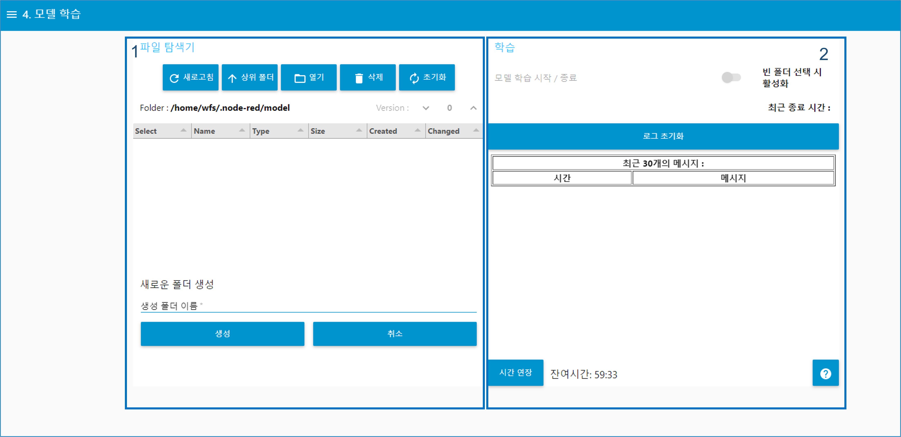
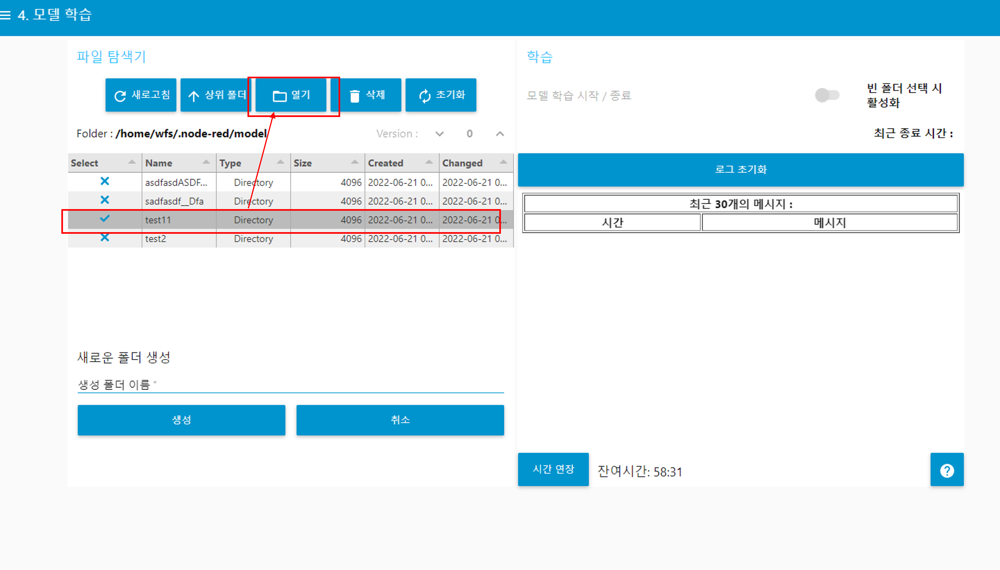
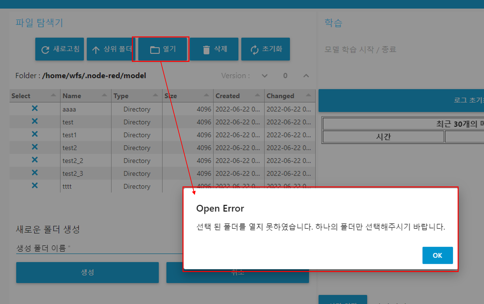
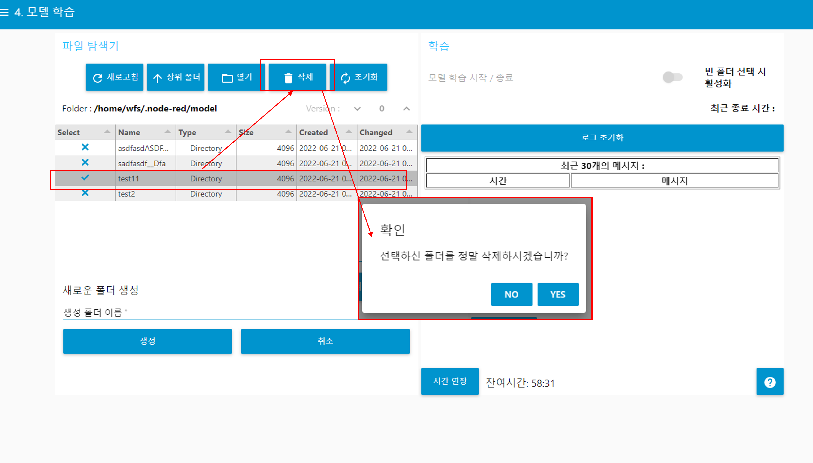
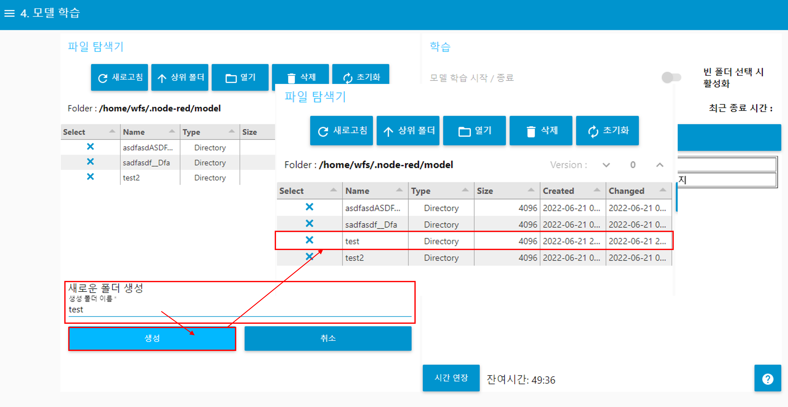
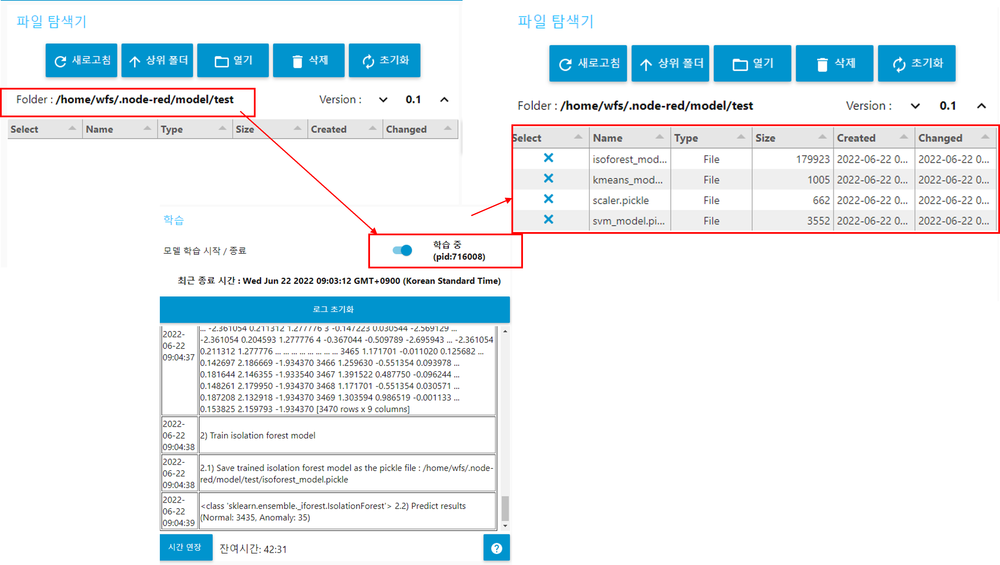
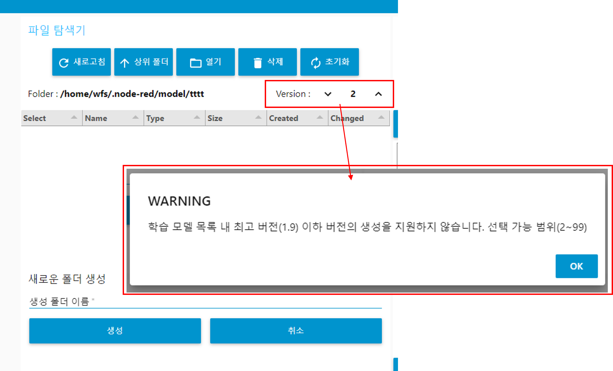

---

sort: 5

---

# 모델 학습

훈련용 데이터셋을 이용하여, 모델을 학습시킨다. 

1. 학습시킨 모델의 폴더 조회 및 신규 학습 모델 폴더 생성을 위한 파일탐색기 영역이다. 
2. 훈련용 데이터셋을 이용하여, 모델을 학습시키는 과정을 나타내는 영역이다.

  

## 학습모델 조작 기능

1.새로고침 버튼: 현재 경로에 대하여, 새로고침한다. 
2.상위 폴더 버튼: 상위경로로 이동한다. "/home/wfs/.node-red/model" 경로까지 가능하다. 
3.열기 버튼: 폴더를 선택한 후, 열기 버튼을 선택하면, 하위경로로 이동한다. 
4.삭제 버튼 : 선택된 폴더를 삭제한다.
5.초기화 버튼 : 초기 위치 "/home/wfs/.node-red/model" 로 이동한다. 
6.생성 버튼 : "생성 폴더 이름"에 생성할 폴더 명을 입력하고, 생성 버튼을 선택하면, 현재 위치에 폴더가 생성된다. 
7.취소 버튼 : "생성 폴더 이름 에 생성할 폴더 명을 입력하고, 취소 버튼을 선택하면, 작성된 폴더 명이 초기화된다. 
8.모델 학습 활성화 버튼: "파일 탐색기"에서 생성한 빈 폴더에 모델을 학습 시킨다. 
9.로그 초기화 버튼: 모델을 학습시키는 과정에 발생한 로그들을 초기화 시킨다. 

  

생성된 폴더를 선택하고, 열기 버튼을 누르면 해당 폴더의 하위 경로로 이동한다.
  

폴더를 선택하지 않고, 열기 버튼을 누르면, "선택된 폴더를 열지 못하였습니다. 하나의 폴더만 선택해주시기 바랍니다." 메시지가 표출된다.
  

삭제하고자 하는 폴더를 선택하고, 삭제 버튼을 누르면, "선택하신 폴더를 정말 삭제하시겠습니까?" 메시지가 표출된다. NO일 경우, 삭제가 취소되며, YES일 경우, 폴더가 삭제된다.
  

"새로운 폴더 생성"에서 폴더 명을 입력하고, 생성 버튼을 누르면, 새로운 폴더가 생성된다.  
폴더 명은 영문자(대/소), 숫자, 특수문자"_" 만 입력가능하다. 만약, 다른 문자로 폴더 명을 생성할 경우, 아래와 같은 알림이 표출된다.

  

## 훈련용 데이터를 이용한 모델 학습

훈련용 데이터를 이용해 모델을 학습시키기 위해서는 학습된 모델을 저장할 새로운 폴더를 생성하고, 모델 학습을 시작해야 한다. 
아래 내용은 새로운 폴더를 생성했다는 가정하에 설명한다.  

**※ 훈련용 데이터가 많을수록 학습 시간이 증가할 수 있습니다. 학습 도중 종료를 시킬 경우에는 해당 폴더에 학습 잔여 파일이 존재할 수 있으므로, 폴더 삭제, 재생성 후 다시 시도해주시기 바랍니다.**
   

"파일 탐색기" 영역에서, 새로운 폴더를 생성한 후, 해당 폴더로 진입한다. 
학습 모델에 대한 Version을 선택한 후, "학습" 영역의 "빈 폴더 선택 시 활성화" 스위치를 선택한다. 
학습 시키는 과정에서 로그가 표출되며, 학습 완료 시, 빈 폴더에 학습된 모델파일들이 생성된다.

  

학습 모델에 대한 Version을 지정할 때, 학습 목록에 존재하는 학습 모델이 가지는 Version 보다 낮으면, 위와 같은 경고 문구가 발생한다.
새로운 학습 모델에 대한 Version을 지정할 때는, 기존 학습 모델의 Version보다 높아야 한다. 
Version 지정은 최대 99까지 가능하다.

  

**※ 본 문서에 안내 된 알림을 제외한 문제가 발생할 경우, 알림 창 안내에따라 구매처로 문의하시기 바랍니다.**