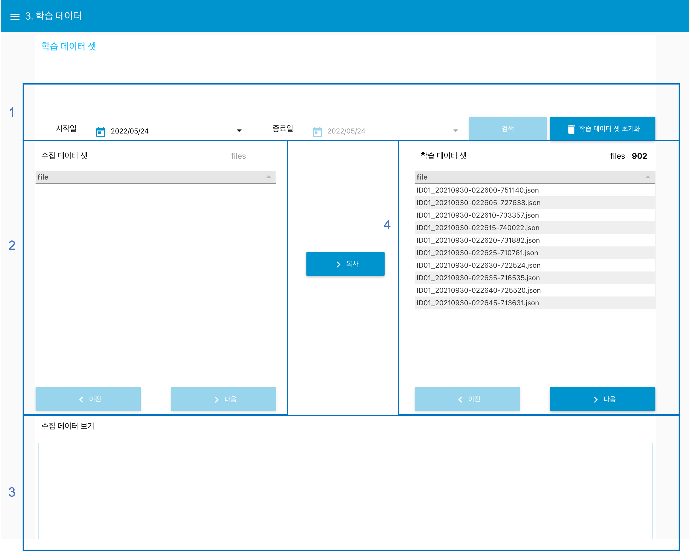
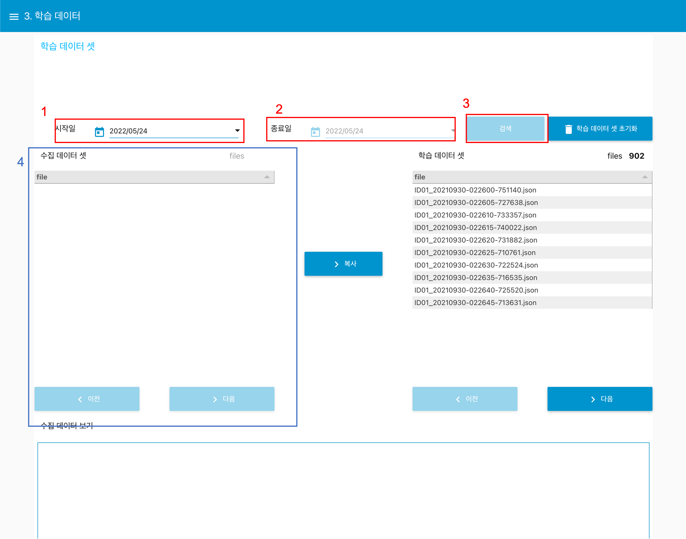
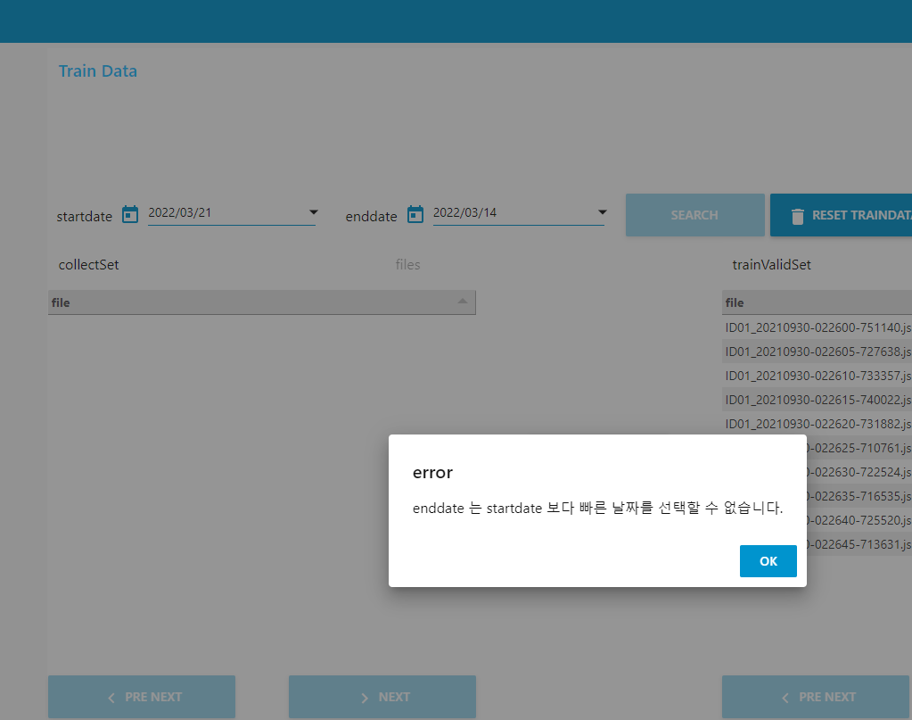
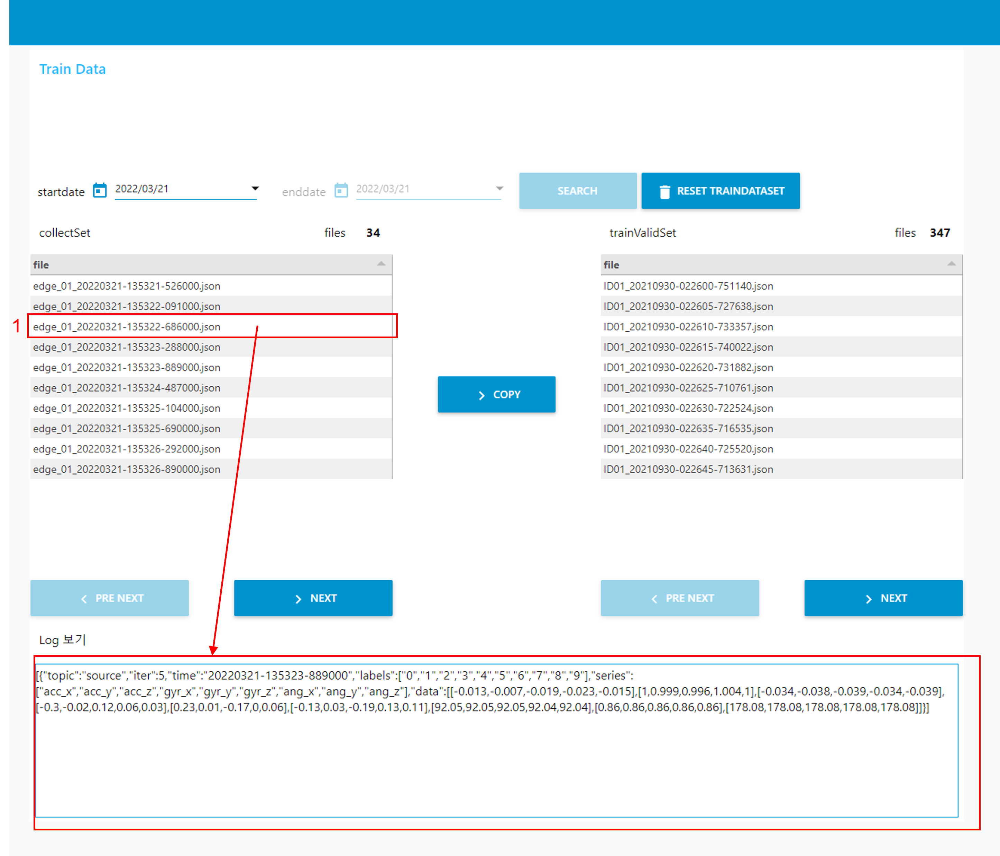
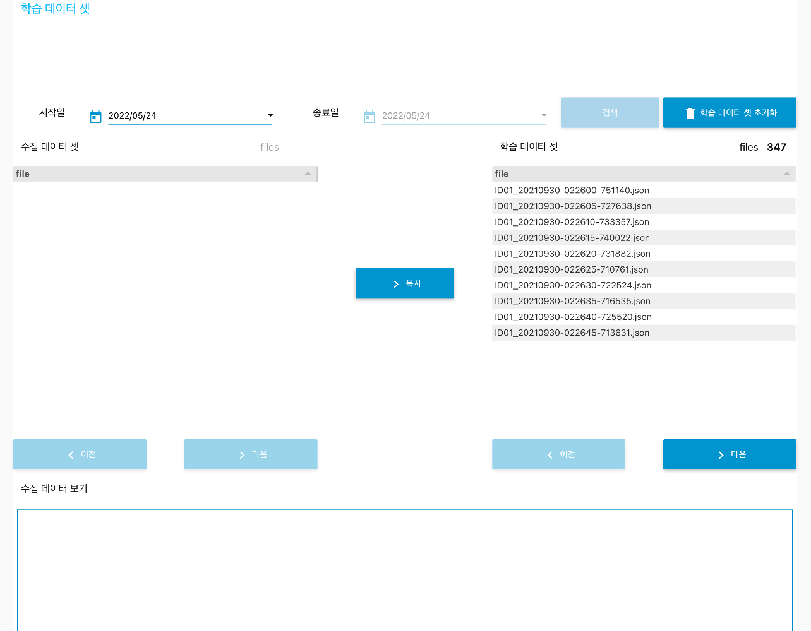

---

sort: 5

---

# Train Data

---

수집된 데이터는 날짜 기준으로 필터링하여, 훈련용 데이터셋으로 복사한다. 훈련용 데이터셋에 있는 데이터들은 모델을 학습하는데 사용된다. 

1. 수집된 데이터에 대하여, 날짜 기반으로 필터링한다.
2. 선택된 날짜에 수집된 데이터가 리스트로 표출된다.
3. 수집된 데이터를 선택하여, 데이터 내용을 확인한다.
4. 훈련용 데이터 리스트를 표출한다.

  

## 날짜를 이용하여, 수집된 데이터 필터링

---

날짜를 이용하여, 수집된 데이터를 필터링하기 위해서는 반드시 시작일과 종료일을 선택해야 한다. 

1. 시작일 : 훈련용 데이터로 쓰일 수집데이터의 시작 날짜를 선택한다. 
2. 종료일 : 훈련용 데이터로 쓰일 수집데이터의 마지막 날짜를 선택한다. 아래는 시작일 보다 종료일의 날짜가 더 이른 경우에 표출되는 알림이다. "종료일은 시작일 보다 빠른 날짜를 선택할 수 없습니다." 문구를 포함한다.

3. 검색 버튼 : 시작일과 종료일 사이에 수집된 데이터를 4. 수집 데이터 셋 에 표출할 수 있도록 한다. 

※ 데이터 양에 따라서 조회하는데 걸리는 시간이 증가할 수 있습니다.

  

## 수집된 데이터 내용 확인

---

1. 수집 데이터 셋에 표출된 데이터를 선택하면, 수집 데이터 보기 통해, 수집된 데이터 내용 일부를 확인할 수 있다.

  

## 훈련용 데이터로 복사

---

1. 복사 버튼 : 날짜 선택 후, 복사 버튼을 선택하면, 수집 데이터 셋 있는 데이터를 학습 데이터 셋 복사하며, 수집 데이터 셋에 표출된 리스트는 초기화된다.

  

## 훈련용 데이터 초기화

---

1. 학습 데이터 셋 초기화 버튼 : 학습 데이터 셋에 포함된 수집 데이터 셋에서 복사해온 모든 데이터를 삭제한다.

  

#### ※ 본 문서에 작성된 알림 창을 제외한 문제가 발생할 경우, 관리자에게 문의하시기 바랍니다.

