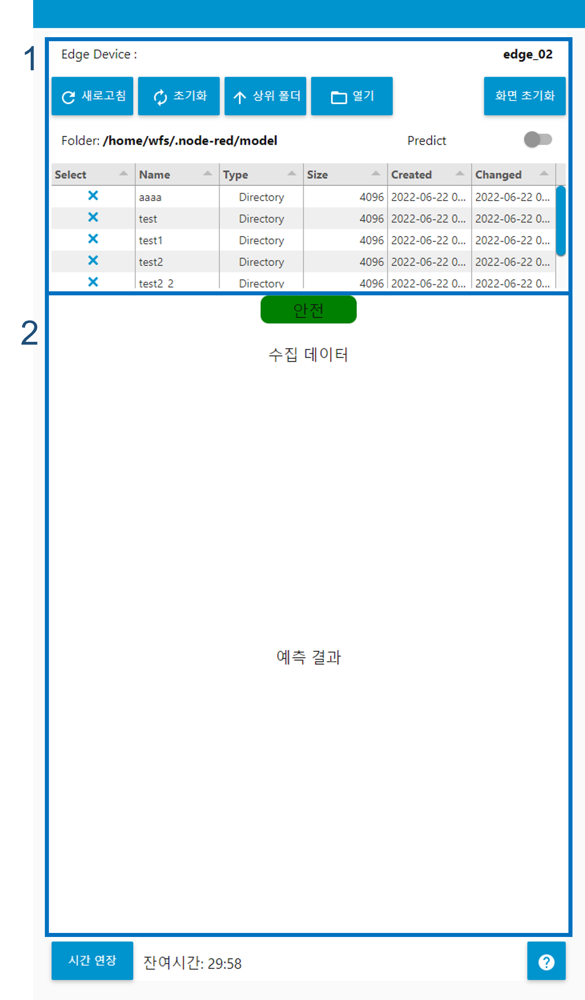
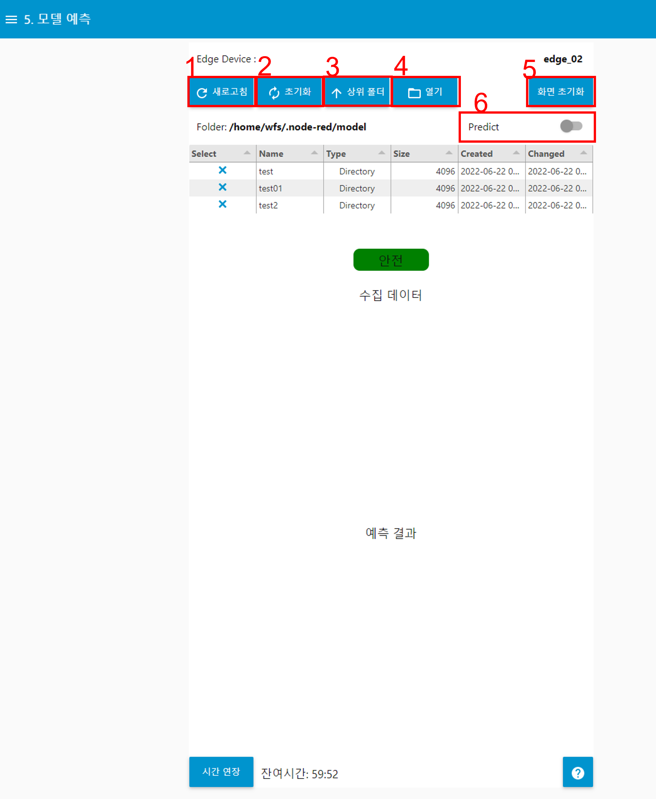
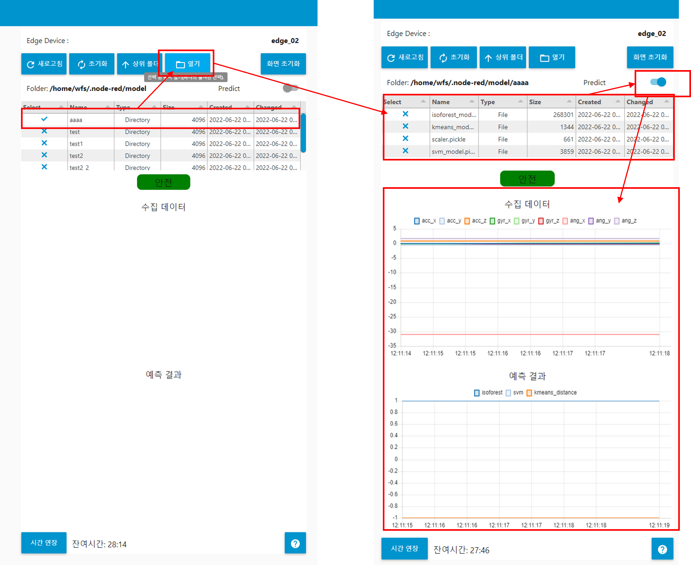
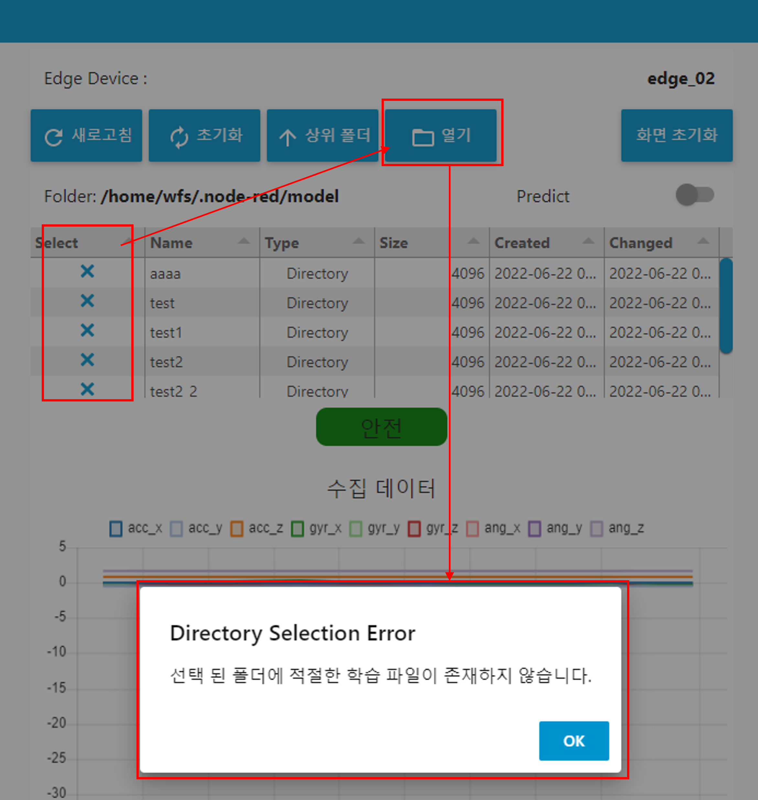
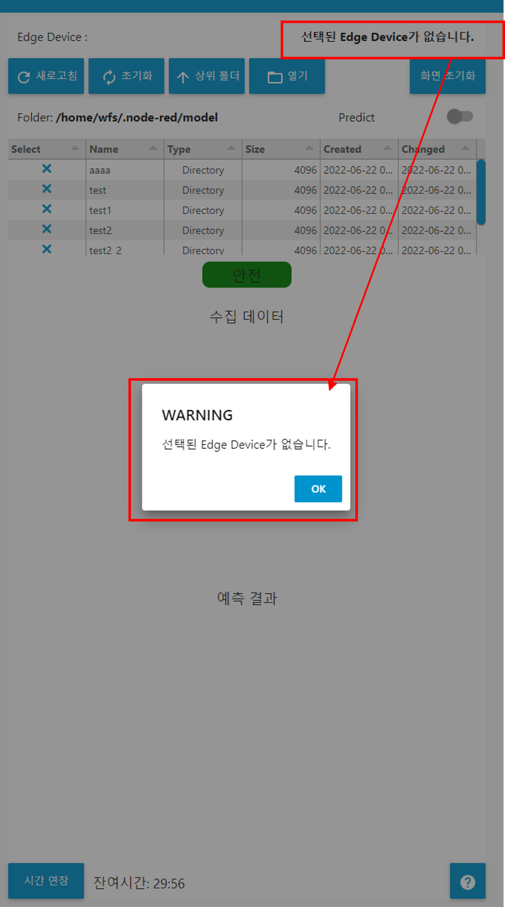

---

sort: 6

---

# 모델 예측

플랫폼 (온프레미스)서버 기반으로 모델을 시험한다. 

1. 파일 탐색기 영역: 예측을 수행할 학습 모델이 포함된 폴더를 선택하는 영역이다.
2. 데이터 및 결과 표출 영역: 선택된 모델을 이용해 엣지 디바이스에서 들어오는 실시간 데이터를 예측하여, 해당 결과를 표출해주는 영역이다.
- 수집 데이터: 실시간으로 들어온 데이터 수치
- 예측 결과: 들어온 데이터에 대한 예측 결과

  

## 파일 탐색기

실시간 데이터 예측을 수행할 학습모델이 있는 폴더로 경로를 선택한다. 

1. 새로고침 버튼: 현재 경로 새로고침 버튼이다. 
2. 초기화 버튼: 초기 상태인 "/home/wfs/.node-red/model" 위치로 돌아간다. 
3. 상위 폴더 버튼: 상위 폴더로 이동한다. "/home/wfs/.node-red/model" 경로까지 이동 가능하다. 
4. 열기 버튼: 선택한 폴더의 하위 경로로 이동한다.
5. 화면 초기화: "데이터 및 결과 표출"영역에 표출된 그래프를 초기화한다.
6. Predict: 학습 모델을 이용하여, 예측을 수행하는 스위치 버튼이다. 
  

## 학습모델을 이용한 데이터 예측

### [ 정상적인 엣지 디바이스를 선택한 경우 ]

학습모델이 있는 경로까지 이동한 후, Predict 스위치를 활성화하면, 일정시간으로 엣지 디바이스로부터 들어오는 데이터 수치와 해당 데이터에 대해 예측 결과를 표출한다. 

실시간 예측을 수행할 학습 모델 폴더를 선택한다. 
폴더를 선택하고, 학습 모델 파일이 존재하는 경로까지 열기 버튼을 이용하여, 이동한다.  
Predict 스위치를 활성화 하여, 실시간으로 들어오는 데이터에 대한 예측을 수행한다.  
들어온 데이터에 대한 수치와 예측 결과는 "데이터 및 결과 표출" 영역에서 표출된다.

  
만약, 학습 모델 폴더에서 학습 모델 파일이 있는 경로까지 이동하지 않고 Predict 스위치를 활성화하면, "선택된 폴더에 적절한 학습 파일이 존재하지 않습니다." 메시지가 출력된다.

  

### [ 엣지 디바이스를 선택하지 않은 경우 ]

엣지 디바이스를 선택하지 않고 Predict 스위치를 활성화하면, "선택된 Edge Device가 없습니다." 메시지가 표출된다.

  

**※ 본 문서에 안내 된 알림을 제외한 문제가 발생할 경우, 알림 창 안내에따라 구매처로 문의하시기 바랍니다.**
