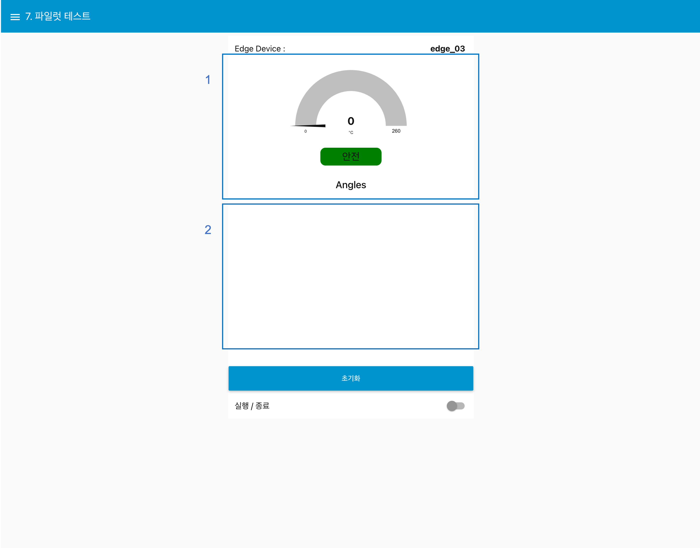
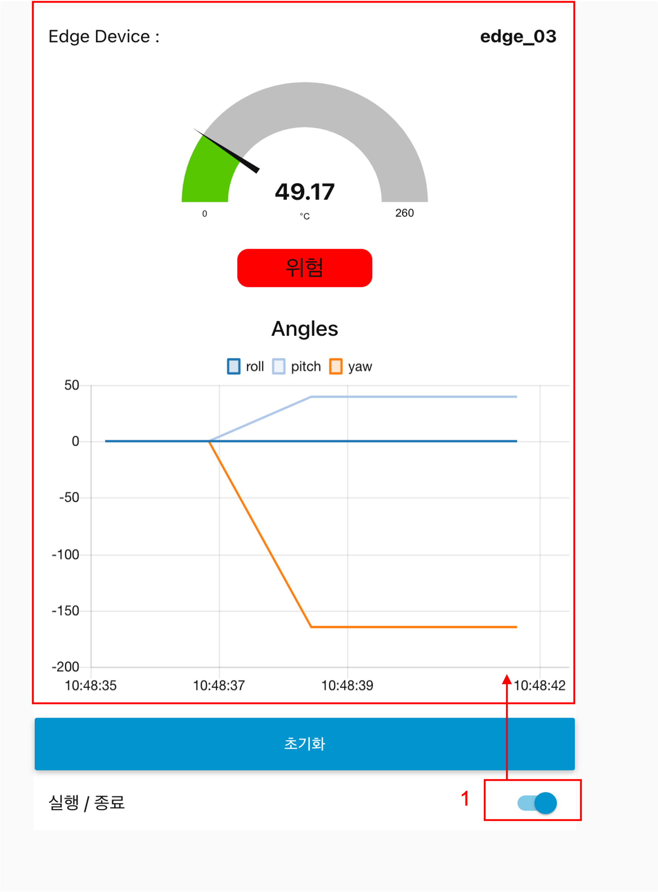
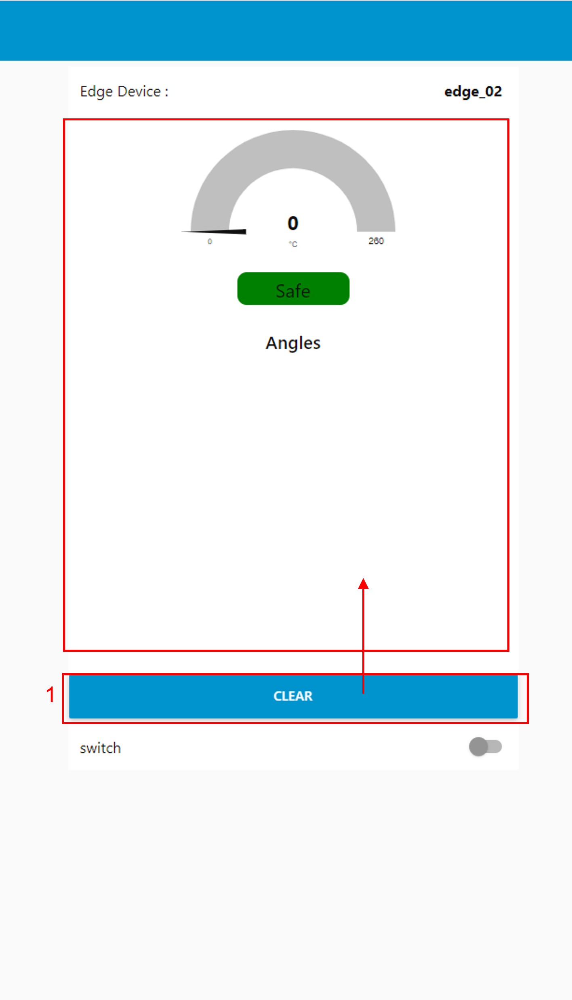
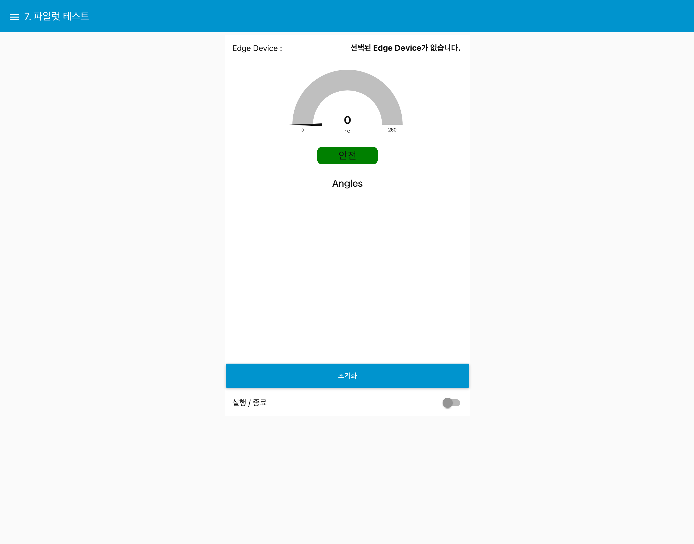
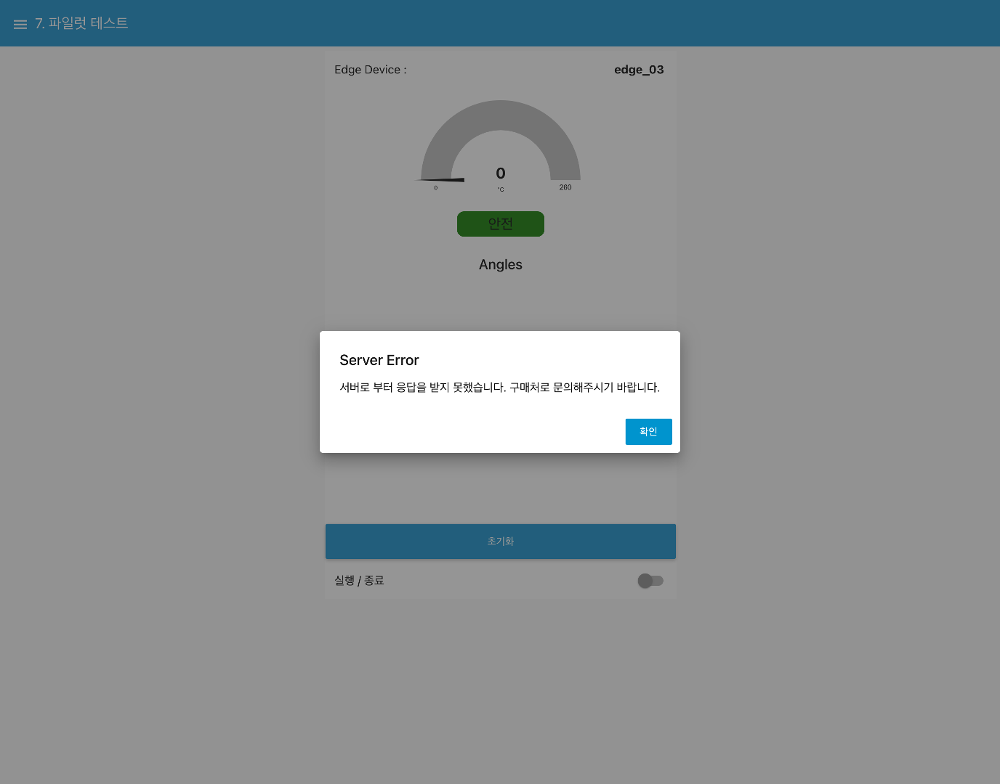

---

sort: 8

---

# 파일럿 테스트

엣지 디바이스에 배포한 학습모델을 기반으로 센서 데이터를 예측한다. 

1. 엣지 디바이스 온도와 배포 된 모델의 예측 결과를 나타내는 영역이다.
2. 센서 데이터로부터 배포 된 모델의 Pitch, Roll, Yaw 예측 수치를 표출하는 영역이다.

  

## 엣지 디바이스에서 배포한 학습모델로 센서 데이터 예측하기

### [ 정상적으로 연결된 엣지 디바이스를 선택한 경우 ]

1. 실행 / 종료 스위치를 활성화하면, 엣지 디바이스에 배포된 학습 모델로부터 예측 데이터를 수집하여 화면에 표출한다.

  

1. 초기화 버튼 : 화면에 표출된 예측 데이터를 초기화한다.

  

### [ 엣지 디바이스를 선택하지 않은 경우 ]

엣지 디바이스를 선택하지 않은 경우, 아래 화면과 같이 초기 화면 표출 이후, 아무 동작도 하지 않는다. 

  

### [ 비정상적인 엣지 디바이스를 선택한 경우 ]

비정상적인 엣지 디바이스를 선택한 경우, 아래 화면처럼, "서버로 부터 응답을 받지 못했습니다. 구매처로 문의해주시기 바랍니다." 문구를 포함한 오류 창을 표출한다.  

  

**※ 본 문서에 안내 된 알림을 제외한 문제가 발생할 경우, 알림 창 안내에따라 구매처로 문의하시기 바랍니다.**