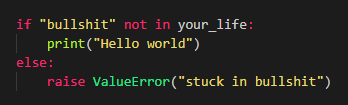

# Thang's Notes

<!-- add picutres in table-->
<!--  
  [](https://www.linkedin.com/in/thang-nguyen-5b458a218) 

--> 

|     |     |
| :---: | :--- | 
|  
[](mailto:caothangckt@gmail.com)  [](https://www.facebook.com/thangckt5)  [](https://orcid.org/0000-0001-9826-5397) | This page dedicates to my personal arbitrary notes and does not reflect either community or third party rules. These notes are improvised and inevitable for some rare situations but helpless for almost others. It's fun if you find something valid here. In other cases, it isn't my business. |


```tip
You cannot teach a man anything, you can only help him find it within himself. - Galileo Galilei (1564–1642)
```

<!--  
```python
if "bullshit" not in your_life:
    print("Hello world")
else:
    raise Error("stuck in bullshit")
``` 
-->

<!--- #### [My CV](https://thangckt.github.io/cv) -->


