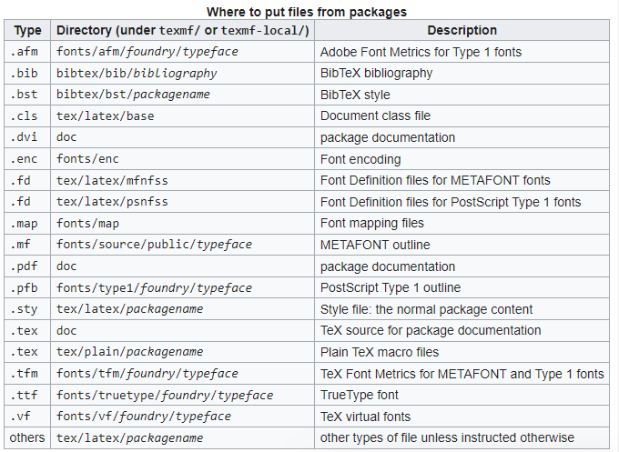
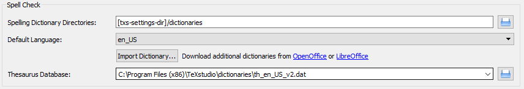

# Latex All-in-one
What is LaTeX?
LaTeX is a typesetting program that takes a plain text file with various commands in it and converts it to a formatted document based on the commands that it has been given. The source file for the document has a file extension of .tex. For more information on LaTeX, see LaTeX on Athena Basics, provided by the Athena On-Line Help system. 

# LaTex Editor and Compiler
To work with Latex, we need a Latex Editor + a Latex Compiler. The editor is used here is TexStudio, accompanied by MikTex.
PdfLaTeX options:  https://docs.miktex.org/manual/miktex-pdftex.html
BibTeX options:    https://docs.miktex.org/manual/miktex-bibtex.html
SyncTeX file: is to jump between PDF/source

## Latex Editor
https://texstudio.org/
1.a. To put all Aux-compiled files into a folder:
## For MiKTeX with TeXstudio, go to Options --> Configure --> Commands:
PdfLaTeX: pdflatex.exe -synctex=1 -interaction=nonstopmode --aux-directory=auxDIR %.tex
BibTeX: bibtex.exe auxDIR/%
latexmk:  latexmk -pdf   -silent -synctex=1 % -auxdir=auxDIR -f -recorder-  
##Build -->  Install "strawberry perl": https://strawberryperl.com/
DefaultCompiler: txs:///latexmk
Log File Seach Paths (in build): auxDIR
## Log file is important to figure out the error. So if use --aux-directory, must add "Additional Search Paths" for "Log File" is auxDIR

1.b. To put date in filename:
PdfLaTeX: pdflatex.exe -synctex=1 -interaction=nonstopmode --jobname="%_$(date +'%B_%d_%Y')"  %.tex
https://www.cyberciti.biz/faq/linux-unix-formatting-dates-for-display/

2. open textstudio on many windows
https://tinyurl.com/y8tq5z9p
right-click shotcut  --> properties --> then include "--start-always" into target

[TexMaker](https://www.xm1math.net/texmaker/download.html) is a parent app of Texstudio

## Latex compiler
can use Miktex or Livetex
https://miktex.org/download

1.c. install a package on MiKTeX (Windows)
https://tex.stackexchange.com/questions/2063/how-can-i-manually-install-a-package-on-miktex-windows
#the default location of installed packages: C:\Program Files\MiKTeX\tex\latex

1.d. Dark theme for TextStudio
- Download the file *.txsprofile elsewhere
https://www.pauljhurtado.com/teaching/software.html
https://tex.stackexchange.com/questions/108315/how-can-i-set-a-dark-theme-in-texstudio
- start TeXstudio -> Options->Load Profile
- Options->Save current setting

2. Use Language Tool in TexStudio
https://tex.stackexchange.com/questions/155148/installing-language-tool-in-texstudio/401103
- Download Language Tool (https://languagetool.org/download/): get .zip file
- Unzip LT -> runlanguagetool.jar. Go to Text Checking > Options> Genera, then check Run as server on port>8081
###########
(kill process on port 8081 windows (if need): https://stackoverflow.com/questions/39632667/how-do-i-kill-the-process-currently-using-a-port-on-localhost-in-windows)
Open Windows PowerShell as Administrator:
netstat -aon | findstr 8081
taskkill /f /pid 19984
#############

- Configure TextStudio to use LT: (Offline usage -> need file:languagetool-server.jar)
--> Options > Configure TeXstudio... > Language checking >
        + set "Server URL" to: http://localhost:8081/
        + set "LT path" to the path of file: languagetool.jar
* More:
        + set "LT Argument" to "org.languagetool.server.HTTPServer -p 8081"
        + check "Start Language Tool if not running"
      

In order to make sure everything is fine, click on Help > Check LanguageTool in TeXstudio. The output should be something like this:

2.a. Download dictionary: 
https://extensions.libreoffice.org/en/extensions/show/english-dictionaries
        - download your dictionary (.oxt)
        - Click on Import Dictionary... and navigate to C:\Program Files (x86)\TeXstudio\dictionaries, then choose the dictionary *.oxt you downloaded.
        - Make sure the default languae is selected (e.g. en_US), and the thesaurus is selected from the same directory (e.g. th_en_US_v2.dat).

      

## Create database (*.bib file) with Zotero
https://guides.library.iit.edu/c.php?g=720120&p=6296986

https://libguides.mit.edu/cite-write/bibtex
Export from Zotero to BibTeX: (Creating a .bib file)
To export all of the references in a certain library to BibTeX, click on the Actions drop-down menu in Zotero and select "Export Library..."
To export only certain references, select those references using control-clicks and shift-clicks, then right click one of them and select "Export Selected Items..."
From the dialog box that pops up, select the BibTeX format, and click OK.
Navigate to the directory where you are storing your manuscript (your .tex file), and save the file. This will generate a file in the appropriate format for BibTeX to read and create a bibliography from.

Auto-syncing from Zotero to BibTeX:
Auto-updating your .bib file when you make changes or additions to your Zotero Library is not available directly in Zotero. You can, however, install and enable a Zotero extension, Better BibTeX, to grant you these features. 
Once Better BibTeX is enabled, select the folder/library/items you wish to include in your .bib file as you would do in the basic export process described above.
In the export dialog box, you will now see many more options for your export format. Select the “Better BibTeX” option, and, to set up the autosync, make sure you also check the “Keep updated” box.
Click Ok, name your .bib file and save in the same location as your LaTeX file.
You can adjust or remove a .bib autosync of Zotero records at any time by going to your Zotero preferences and clicking on the Better BibTeX tab, followed by the Automatic Export tab.
For more detailed instructions on setting up your Zotero export, see the Zotero and BibTeX Quick Guide.

Change Citation-Key in BibTeX:
https://retorque.re/zotero-better-bibtex/citing/
get there via the Zotero preferences, or by clicking the Better BibTeX “Preferences” button in the addons pane.
* Better Bidtex default: [auth:lower][shorttitle3_3][year]
* Google Scholar form: [auth:lower][year][shorttitle1_0]

Cite from Zotero:
right-click --> Better BibTex --> Push reference to TexStudio

Create BibLib file:
1. create folder in Zotero
2. Right-click on folder --> Export Collection --> Better BibTex+Keep Update

Fields to omit from export:
Zotero -> Edit -> Preference -> Better BibTex -> Fields to omit from export: abstract,file,URL,note,language
* Note: Bibtex use the "Citation Style Language", more variables find here: https://docs.citationstyles.org/en/stable/specification.html#appendix-iv-variables

# Create database (*.bib file) with Mendeley
https://tinyurl.com/y49dqosw

