# Workbench 편집화면
---
BeeAI 워크벤치는 사용자가 워크플로우를 쉽게 정의할 수 있도록 그래픽 기반의 워크플로우 편집 기능과 워크플로우를 안정적으로 운영하는 기능을 제공합니다. 본 매뉴얼에서는 편집화면을 설명합니다.

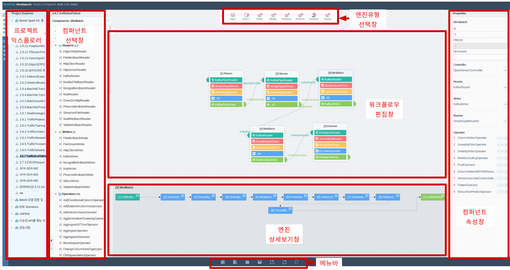

## 프로젝트 익스플로러
BeeAI 에서는 인공지능 서비스 한 개 이상의 워크플로우로 작성하고, 다수의 워크플로우 모음을 프로젝트 단위로 구성하여 관리할 수 있습니다.
프로젝트 익스플로러에서는 프로젝트 생성/수정/삭제, 워크플로우 생성/수정/삭제/열기 기능이 제공되며 마우르 오른쪽 버튼을 클릭하여 확인 할 수있습니다.

## 엔진유형 선택 창

사용자가 다양한 형태의 서비스를 만들 수 있도록 여러가지 엔진 유형을 제공합니다. 사용자가 원하는 엔진 유형을 선택한 후 **워크플로우 편집 창** 으로 drag & drop 하여 사용할 수 있습니다. 각 엔진 타입에 대한 자세한 내용은 <a href="./2.4.1.EngineTypeList.md">엔진 유형 목록</a> 을 참조 하시기 바랍니다.

## 컴퍼넌트 선택 창

엔진을 구성하는데 필요한 컴퍼넌트를 5종으로 구분하여 관련 컴퍼넌트 리스트를 제공하는 화면입니다. 사용자는 원하는 컴퍼넌트를 선택하여 **엔진 컨테이너** 으로 drag & drop 하면 자동으로 엔진 컨테이너에 탑재되어 손쉽게 엔진을 구성할 수 있습니다. 5종의 컴퍼넌트는 아래와 같으며 구체적인 컴퍼넌트 리스트는 <a href="../scaladoc_1906/scaladoc_1906.zip">컴퍼넌트 목록</a> 을 참조하시기 바랍니다. 컴퍼넌트 목록과 설명은 Scaladoc 으로 제공합니다.

- **Reader**: 데이터를 읽어오기 위한 입력 컴퍼넌트들을 보여줍니다.
- **Writer**: 데이터를 출력하기 위한 컴퍼넌트들을 보여줍니다.
- **Operator**: 데이터 처리를 위한 컴퍼넌트들을 보여줍니다.
- **Runner**: 엔진의 실행환경과 관련된 컴퍼넌트들을 보여줍니다.
- **Controller**: 컴퍼넌트들의 동작을 제어하기 위한 컴퍼넌트들을 보여줍니다.

각 엔진유형 별로 사용할 수 있는 컴퍼넌트들이 매핑되어 있으며, 각 컴퍼넌트에 마우스를 오버하면 간단한 설명(Description) 을 볼 수 있습니다.

## 컴퍼넌트 속성 창
탑재된 컴퍼넌트의 속성을 설정하는 화면을 제공합니다. 사용자가 **탑재된 컴퍼넌트** 를 클릭하면, 컴퍼넌트 속성 창에 해당 컴퍼넌트의 속성을 위한 입력창들이 제공됩니다.

속성 창에서 별표(&#10033;) 표시는 반드시 입력해야 하는 필드를 나타냅니다. 해당 필드의 속성을 입력하지 않으면 워크플로우가 실행되지 않습니다.
반복적으로 입력하는 필드일 경우, &#10010; 버튼을 반복적으로 클릭하여 입력합니다.
하위에 여러 필드를 가지는 속성일 경우, 클릭하면 별도의 팝업창이 나타나서 입력할 수 있습니다.

### Help 참조
속성 창에서는 별도의 Help를 제공하여 사용자가 이를 참조하여 속성 값을 입력할 수 있도록 지원합니다. Help 버튼(?)을 클릭하면 팝업창이 나타납니다. 구체적인 속성 입력 방법은 <a href="./2.5.2.KMeansExample.md">워크플로우 예제 만들기</a>를 참조합니다.

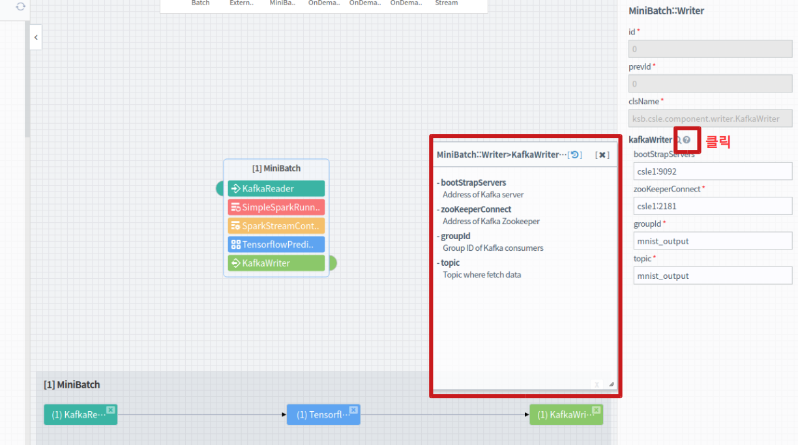

### 파일 경로 선택
파일 경로 속성을 입력하는 방법은 두 가지를 제공합니다.

#### 1) 파일탐색기 버튼을 이용하는 방법
filePath, pyEntryPath 등과 같이 Path로 끝나는 필드 이름을 가지는 속성은 입력창 옆에 `File` 버튼이 있습니다. 이 버튼을 클릭하여 탐색기 창을 통해 하둡파일시스템(HDFS)의 파일 또는 경로를 선택하는 것이 가능합니다.

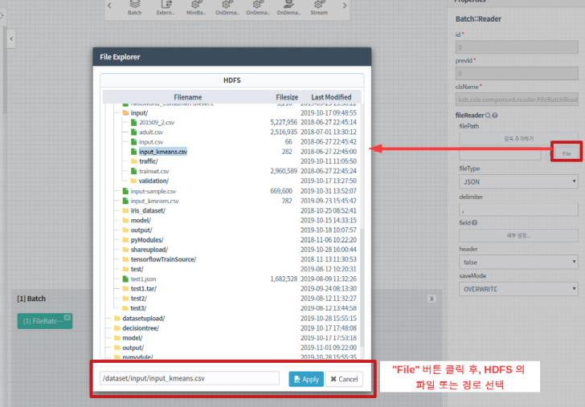

`File`  버튼을 통해서 선택한 경로는 **하둡파일시스템의 상대경로** 이며, IN2WISER로 제출 되면, 시스템에서 자동으로 **사용자 기본 파일경로** 를 추가하여 처리합니다.

#### 2) 직접 입력하는 방법
- `File` 버튼 옆의 텍스트박스에, 사용자가 파일시스템 정보(*hdfs://* 또는 *file://*)를 포함한 전체경로를 직접 설정한 경우, IN2WISER 프레임워크는 해당 경로에 대해 기본 파일경로 추가 등의 처리를 하지 않으며, 입력한 파일시스템 상의 경로가 그대로 IN2WISER 프레임워크 내부에서 사용됩니다.
- */home/csle/...* 와 같이  최상위 경로정보 *'/'* 로 시작하는 경우, 해당파일시스템의 최상위로 시작하는 경로로 인식합니다.
- *'dataset/...'* 와 같이 상대경로를 지정한 경우, 상기에 설명한 **사용자 기본 파일경로** 가 상대경로 앞에 적용됩니다. 예를 들면, *'dataset/...'* 을 입력한 경우, *'hdfs://{host}:{port}/user/{user_id}/dataset/...'* 로 변경되어 IN2WISER 프레임워크 상에서 처리됩니다.

## 메뉴바
**프로젝트 생성, 워크플로우 생성/로딩/저장/불러오기/내보내기/스펙보기 기능**을 선택할 수 있도록 **7개의 버튼** 으로 구성된 화면입니다.New Project, New Workflow, Load Workflow, Save Workflow, Import from file, Export to file, Show Workflow Spec 메뉴로 구성됩니다. 구체적인 메뉴 설명은 아래와 같습니다.

### New Project
새로운 프로젝트를 생성합니다.
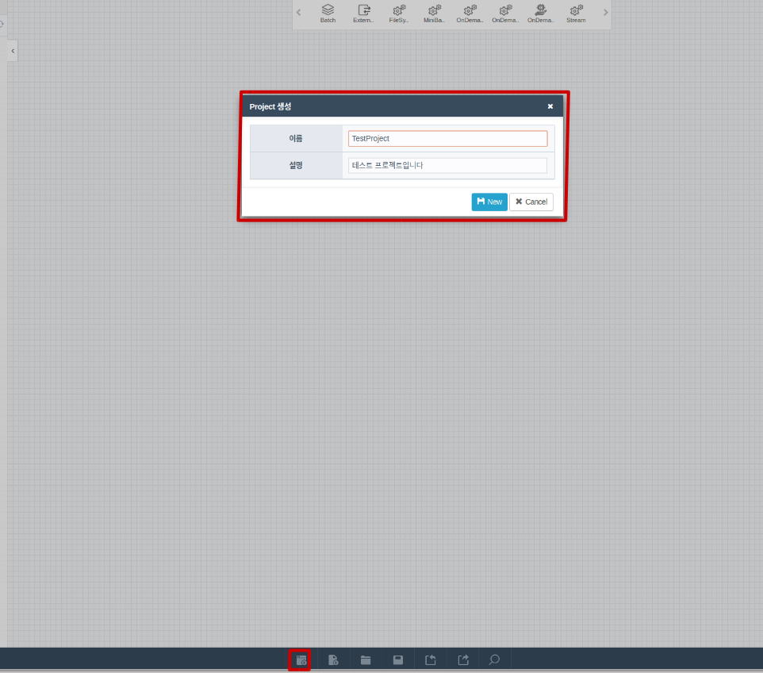

또는 Project explorer 에서 오른쪽 버튼을 클릭해서 신규 프로젝트를 생성할 수 있습니다. 신규 Proejct 생성 및 삭제 절차는 다음고 같습니다.

### New Workflow
새로운 워크플로우를 생성합니다. 하나의 워크플로우를 생성할 때는 버전을 선택하여 생성하며, 생성된 워크플로우의 버전은 변경할 수 없습니다. 해당 워크플로우가 생성될 때 선택한 버전으로 항상 로딩 되고 실행됩니다. 

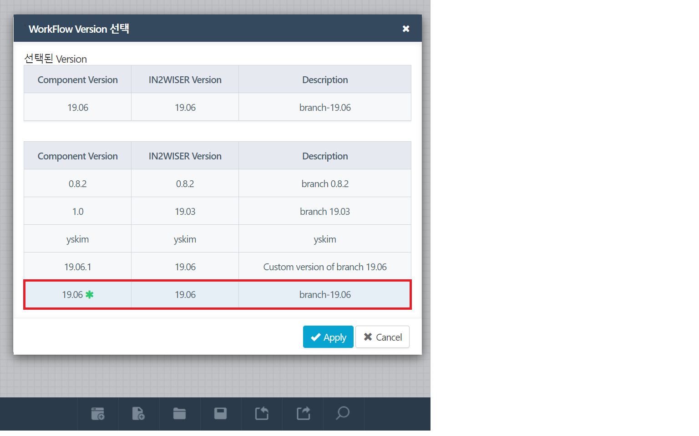

또는 Project explorer 에서 특정 project 를 선택하고, 오른쪽 버튼을 클릭해서 신규 워크플로우를 생성할 수 있습니다. 신규 Workflow 생성 및 수정/삭제 절차는 다음고 같습니다.
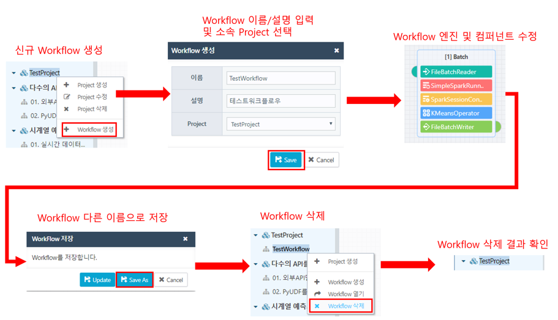

### Load Workflow
IN2WISER 웹툴킷의 DB에 저장된 워크플로우를 불러옵니다. 삭제(&#9747;) 버튼을 눌러 해당 워크플로우를 삭제할 수 있습니다. 이전에 실행한 이력이 있는 워크플로우를 삭제 하는 경우, 해당 워크플로우의 실행 이력 및 로그파일도 모두 삭제 됩니다. 또한 표의 헤더('이름', '설명','저장날짜', 'Component Version')을 클릭하여 정렬할 수 있습니다.

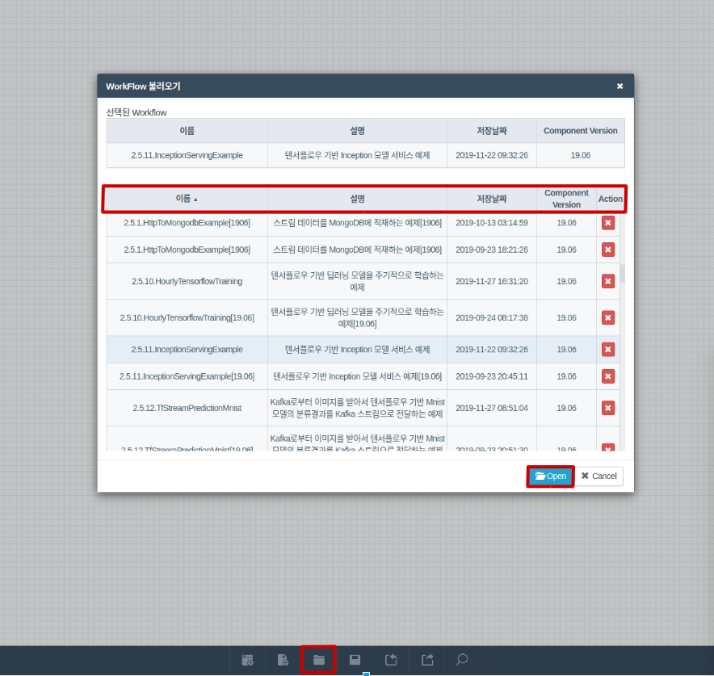

### Save Workflow
작성 중인 워크플로우를 DB에 저장합니다. 워크플로우를 처음 저장할 경우 프로젝트를 선택하고 워크플로우의 이름과 설명을 입력 후 저장합니다. 기존에 저장한 워크플로우를 수정했을 때는 저장 버튼을 누른 후 *Update* 를 통해 워크플로우를 갱신하거나 *Save As* 를 통해 새로운 워크를로우로 저장할 수 있습니다.

저장한 워크플로우의 이름은 컴퍼넌트 선택창 상단에 나타납니다. Workflow Property 도 워크플로우 편집기의 우측 창에 나타납니다. 워크플로우의 name, desctiption, isBatch 설정값, verbose 설정값, runtype 설정값을 확인할 수 있습니다.

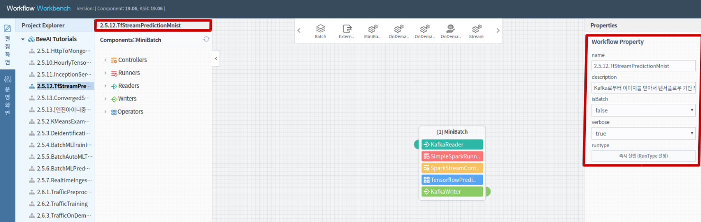

### Import from file
Export 된 Json 포맷의 워크플로우 파일을 불러옵니다. "파일선택" 버튼을 클릭하여 워크플로우 파일을 선택한 후 "Import" 버튼을 클릭하여 워크플로우를 불러옵니다.

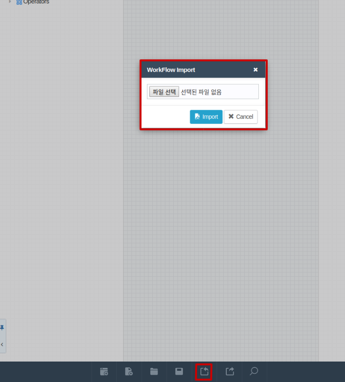

### Export to file
작성한 워크플로우 Spec 을 Json 포맷의 파일로 내보냅니다. Json 파일에 작성한 워크플로우의 spec이 저장되므로 Import 기능을 통해 워크플로우를 불러올 수 있습니다. 다른 사용자에게 내가 작성한 워크플로우를 공유하고자 할 때 사용합니다.
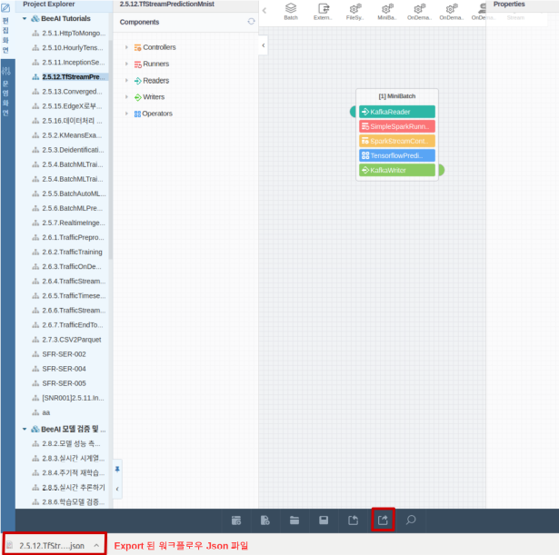

### Show Workflow/Engine Spec
작성한 워크플로우의 스펙 을 확인하는 버튼입니다. 워크플로우를 운영하기 전에 Json 형태로 작성된 워크플로우 스펙을 확인할 수 있습니다. 워크플로우의 이름과 설명을 입력하지 않았을 경우 이를 입력해야 합니다. 또한 Batch 여부 (배치처리일 경우 Batch 를 체크함) 와 Verbose (디버깅을 위해 상세 로그 정보를 확인 할 경우 체크함. 로그 정보가 상세하게 기록 됨.) 를 선택한 후 제출합니다. BeeAI 는 사용자가 작성한 Json 형태의 워크플로우 Spec 을 해석하여 엔진들을 동적으로 구성하고 실행합니다.  

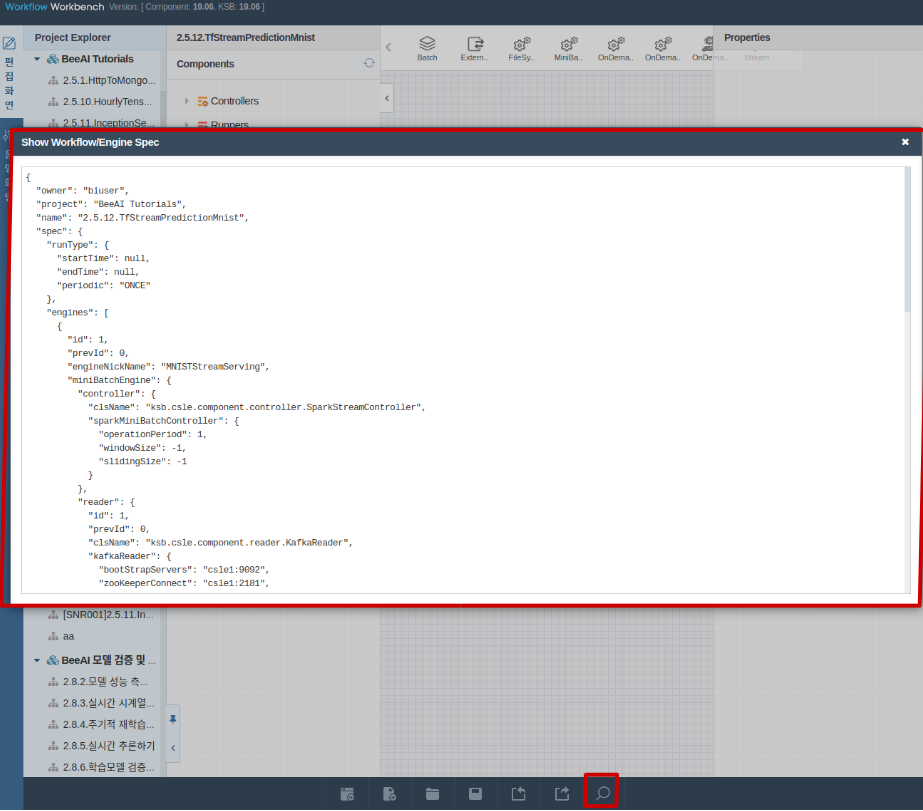

## 워크플로우 편집 창
사용자가 직관적으로 엔진이나 컴퍼넌트를 편집할 수 있도록 워크플로우 편집 화면을 제공합니다. 사용자는 편집하고자 하는 엔진을 선택하거나 위치를 조정할 수 있습니다. 또한 필요한 컴퍼넌트들을 탑재하거나 삭제할 수 있습니다.

또한 엔진을 선택하고 마우스 오른쪽 버튼을 클릭하면 다음과 같은 메뉴를 사용할 수 있습니다.

- Engine 순서 설정
- Engine 순서 수정
- Engine 순서 보기
- Engine 복제
- Engine 삭제
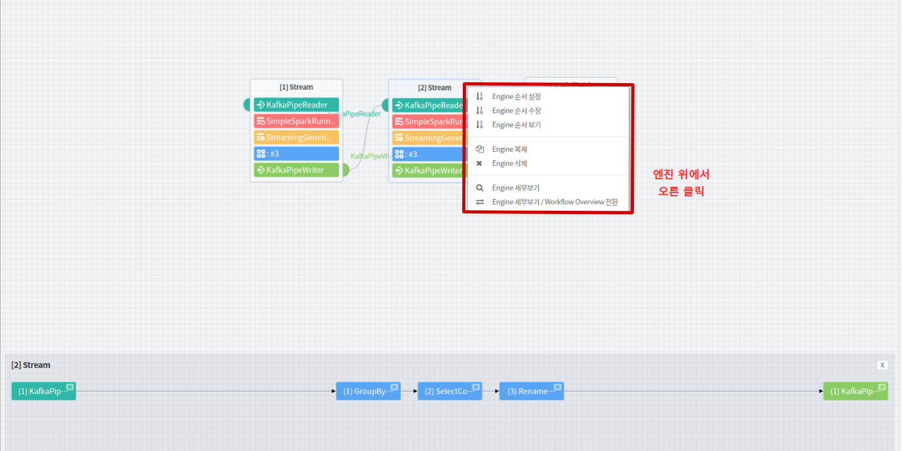

워크플로우 편집창의 빈 공간에서 마우스 오른쪽 버튼을 클릭하여 다음과 같은 메뉴를 사용할 수도 있습니다.

- Engine 순서 설정
- Engine 순서 수정
- Engine 순서 보기
- Engine 세부보기/ Workflow Overview 전환

두 개 이상의 엔진을 구성하였을 경우, **선 연결** 및 **선 삭제** 기능을 이용할 수 있습니다.
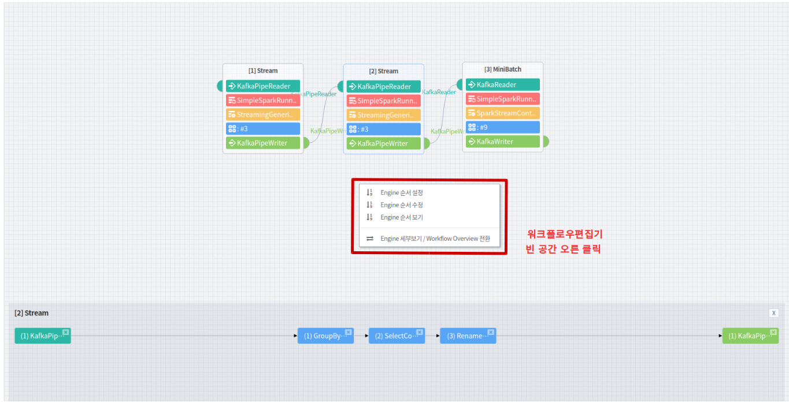

### 엔진 복제
선택한 엔진과 동일한 엔진을 하나 더 만듭니다.

### 엔진 삭제
선택한 엔진을 삭제합니다. 

### 엔진 순서 설정
엔진들 간의 순서를 설정합니다. "Engine 순서 설정" 을 클릭하면 워크플로우 편집 창이 비활성화 됩니다. 이 때 엔진을 차례대로 클릭하여 순서를 지정하고, Apply 버튼을 누릅니다.
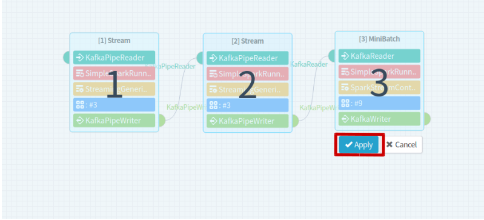

### 엔진 순서 수정
엔진들 간의 순서를 수정합니다. "Engine 순서 수정" 을 클릭하면 워크플로우 편집창이 비활성화 되고, 현재 엔진들의 순서가 표시됩니다. 엔진 위의 숫자를 drag 하여 순서를 수정하고 Apply 버튼을 누릅니다.
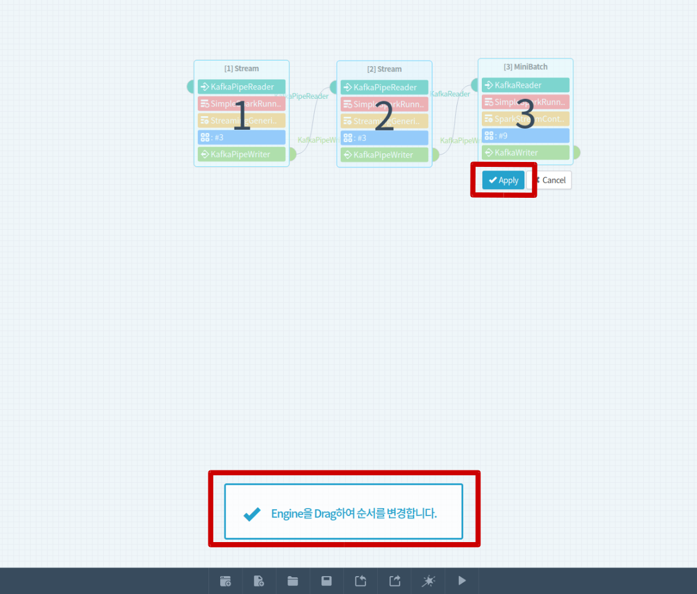

### 엔진 순서 보기
엔진 순서를 확인합니다.
"Engine 순서 보기" 를 클릭하면 워크플로우 편집창이 비활성화 되고, 현재 엔진들의 순서가 표시됩니다. 확인이 끝났으면 마우스 오른쪽 버튼을 클릭하여 "Engine 순서 보기 닫기" 를 클릭합니다.

### 선 연결
워크플로우 편집 화면에서 선은 데이터 패스를 의미하며, 두 엔진을 선으로 연결하는 것이 가능합니다. 앞 엔진의 Writer 부분의 반달 모양에서 마우스를 클릭한 후 뒤에 있는 엔진의 Reader 부분의 반달 모양으로 drag & drop 하여 선을 연결합니다. Writer 와 Reader 의 이름이 다를 경우 다음과 같은 안내문이 나오며, 그래도 연결하고자 할 경우 연결하면 됩니다.

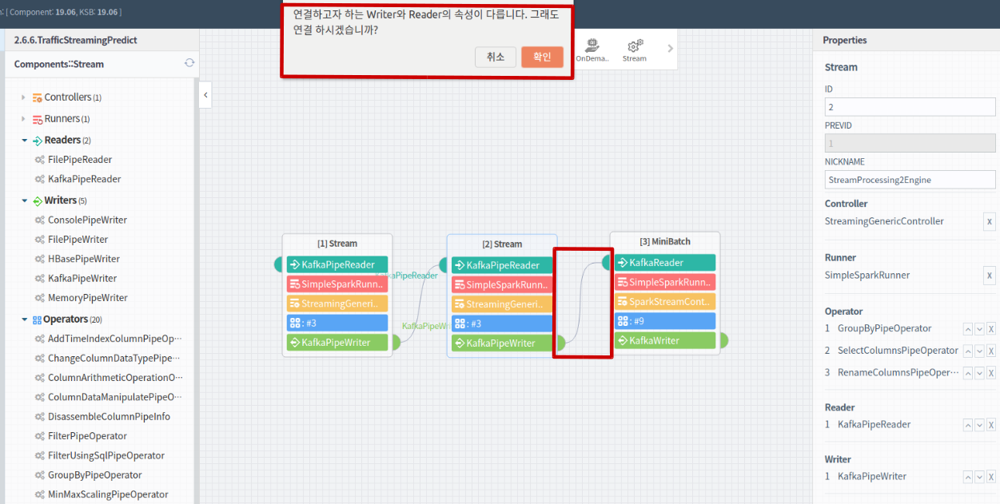

Writer 와 Reader 의 이름이 같을 경우에는 다음과 같이 Writer 의 속성값을 Reader 의 속성값으로 덮어쓸지를 선택하는 안내창이 나옵니다. "확인"을 클릭할 경우 Writer 의 속성값을 Reader 의 속성값으로 덮어쓰고, "취소"를 클릭할 경우 덮어쓰지 않습니다. 동일한 속성을 가지지 않았을 경우 (Writer 와 Reader 가 동일한 Component Property 를 가지지 않을 경우) 덮어쓰지 않을 것을 권장합니다.  

### 선 삭제
두 엔진을 연결한 선을 삭제하고자 할 경우 선이 있는 곳에서 마우스 오른쪽 버튼을 클릭하여 "Link 삭제"를 선택합니다.

## 엔진 상세보기 창
엔진의 이름을 클릭하면 워크플로우 편집창 하단에 엔진 상세보기 창이 나타나며 엔진이 가진 Reader, Operator, Writer 들을 보여줍니다. 하나의 엔진에서 Reader, Operator, Writer는 여러 개를 가질 수 있습니다 (엔진 타입에 따라 하나만 가지거나 없는 경우도 있을 수 있음). 반면 Controller, Runner 는 반드시 하나만 가질 수 있습니다. 엔진 상세보기 창에서 각 컴퍼넌트를 drag & drop 하여 순서를 변경할 수 있습니다.

## Engine 세부보기/ Workflow Overview 전환
워크플로우 편집기의 빈 공간에서 오른 클릭 후, "Engine 세부보기/ Workflow Overview 전환" 을 선택하면, 워크플로우 편집기와 엔진 상세보기창이 반전됩니다. 엔진 상세보기 창이 워크플로우 편집창의 윗쪽에 출력됩니다. 엔진 내부의 컴퍼넌트들을 보다 상세하기 보며 워크플로우를 만들때 유용한 기능입니다.
