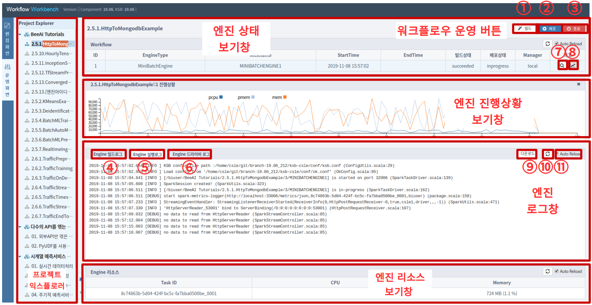
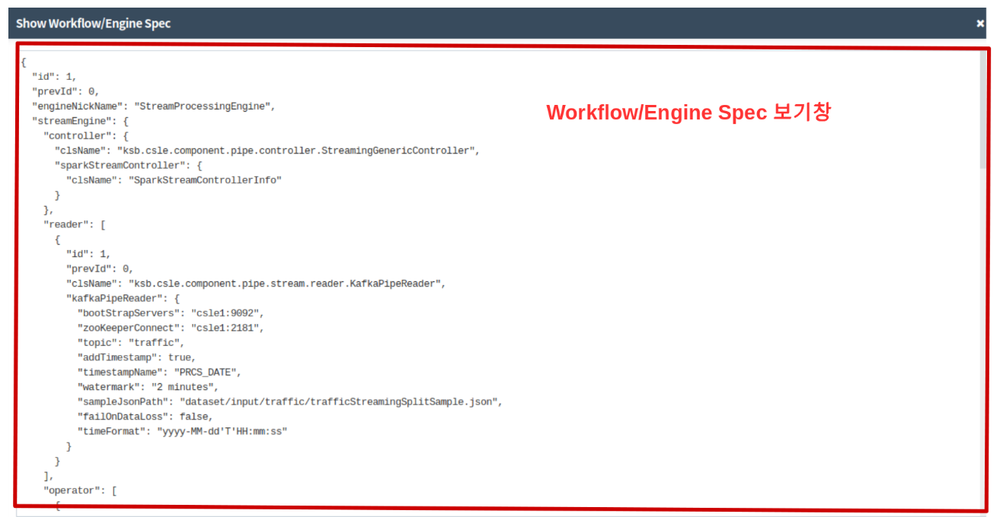

# Workbench 운영화면
---

IN2WISER 워크벤치는 사용자가 워크플로우를 쉽게 정의할 수 있도록 그래픽 기반의 워크플로우 편집 기능과 워크플로우를 안정적으로 운영하는 기능을 제공합니다. 운영화면은 크게 (1)프로젝트익스플로러 (2) 워크플로우 운영 버튼 (3) 엔진 상태 보기창 (4) 엔진 로그창 (5) 엔진 리소스창 으로 구성됩니다. 항목 별 세부 설명은 아래의 설명을 참조하시기 바랍니다.

## 프로젝트 익스플로러
운영화면의 프로젝트 익스플로러에서는 사용자의 전체 프로젝트와 워크플로우를 확인할 수 있습니다. 빌드 및 실행하고자 하는 워크플로우를 클릭하여 선택합니다.

## 워크플로우 운영 버튼
편집화면에서 제작한 IN2WISER 워크플로우는 엔진 상태 보기창 상단의 **&#10112;**, **&#10113;**, **&#10114;** 세가지 버튼으로 운영합니다.

**&#10112; **빌드 버튼** **
워크플로우를 구성하는 엔진들을 전체 빌드합니다. 빌드 단계는 사용자가 작성한 워크플로우에 오류가 없는지 체크하며, 빌드가 실패한 경우에는 워크플로우를 배포 및 실행할 수 없습니다.

**&#10113; **배포 버튼** **
빌드가 성공적으로 완료된(succeeded) 엔진들을 클러스터에 배포하고 실행합니다. 빌드가 실패한(failed) 엔진은 **&#10115; Engine빌드로그창**에 보이는 에러메세지를 확인한 후, 잘못된 부분을 수정하고 다시 빌드하여 빌드가 성공한 이후에 실행 할 수 있습니다.

**&#10114; **종료 버튼** **
실행 중인 워크플로우를 종료하는데 사용합니다.

## 엔진 상태 보기창
워크플로우를 구성하는 모든 엔진들의 상태를 확인할 수 있습니다. 엔진마다 **엔진 ID**, **엔진유형**, **닉네임**, **실행시작시간**, **실행종료시간**, **빌드상태**, **배포상태**, **Manager유형** 정보가 표시됩니다. **&#10118;  엔진스펙보기** 버튼을 클릭하면, 'Workflow/Engine Spec 보기창' 이 띄워집니다.  **&#10119;  엔진진행상황보기** 버튼을 클릭하면 엔진진행상황보기창이 펼쳐집니다.

## 엔진 진행상황 보기창
엔진이 실행되며 CSV 파일로 결과가 출력되는 경우에 이를 시각화해서 보여주는 창입니다. 이 버튼은 엔진의 실행 결과가 CSV 파일에 기록되도록 디자인된 엔진에서만 활용 가능하며, 머신러닝/딥러닝 모델 학습용 엔진의 경우에 이 기능을 활용하면 학습의 진행상태를 쉽게 확인할 수 있습니다.  

## Workflow/Engine Spec 보기창

## 엔진 로그창
엔진의 빌드 중 발생하는 로그는 **&#10115; Engine빌드로그** 탭, 실행 중 발생하는 로그는 **&#10116; Engine실행로그** 탭, 실행 중 Spark 의 드라이버에서 발생하는 로그는 **&#10117; Engine드라이버로그** 탭에 출력됩니다. 사용자는 출력되는 로그 메세지를 보며 엔진이 정상 빌드되었는지 여부와 엔진이 정상적으로 동작하고 있는지 확인 할 수 있습니다.

**&#10120; 다운로드** 버튼을 클릭하여 해당 로그를 로컬파일시스템으로 다운 받을 수 있습니다. **&#10121; 새로고침** 버튼을 클릭하면 최신 로그가 출력됩니다. **⑪ Auto Reload** 체크박스를 체크해 놓으면, 자동으로 로그를 로딩되어 항상 최신 로그가 출력됩니다.       

## 엔진 리소스창
엔진이 실행되며 사용중인 컴퓨팅 리소스의 양이 표시되는 창입니다. 해당 엔진이 실행되며 사용되는 CPU(%) 사용량과 Memory(%) 사용량을 보여줍니다.  