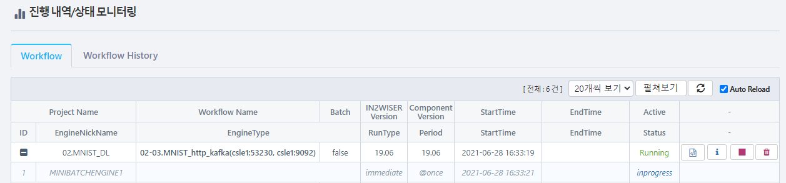
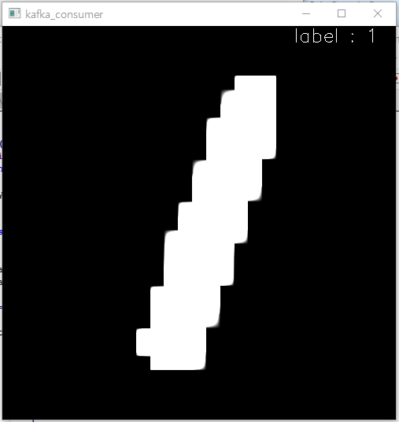

# REST API로 입력받아 kafka로 결과 전달하기

해당 예제는 MNIST 모델을 이용한 이미지 예측입니다. 

입력으로 HTTP 통신을 이용하며, 워크플로우는 전달받은 데이터에 대한 예측 값을 kafka에 전달합니다.

<br>

## kafka topic 설정값

| 속성             | 설정값             |
| ---------------- | ------------------ |
| bootStrapServers | csle1:9092         |
| zooKeeperConnect | csle1:2181         |
| groupId          | mnist_output_dl_03 |
| topic            | mnist_output_dl_03 |

<br>

## 워크플로우 빌드하기

IN2WISER 웹툴킷 상단 **Workbench** 의 **운영화면** 탭을 선택하여, **빌드**버튼을 선택합니다. **Engine 빌드로그** 에서 확인할 수 있습니다.


<br>

## 워크플로우 배포하기

IN2WISER 웹툴킷 상단 **Workbench**의 **운영화면** 탭을 선택하여 빌드를 진행했다면, **배포** 버튼을 선택하여, 워크플로우를 실행시킵니다.  **Engine 실행로그** 에서 확인할 수 있습니다.


<br>

## 워크플로우 모니터링하기

IN2WISER 웹툴킷 상단 **Monitoring** 탭에서 워크플로우의 진행 내역/상태를 확인할 수 있습니다.



<br>

## 워크플로우 종료하기

IN2WISER  웹툴킷 상단 **Monitoring** 에서 **Workflow** 탭을 선택하여, 현재 Status가 Inprogress인 02-03.MNIST_http_kafka(csle1:53230, csle1:9092) 워크플로우의 정지버튼(<span style="color:red">&#9724;</span>)을 클릭하여 종료시킵니다.


<br>

## 결과 확인


##  입력 데이터 전달하기

예측하고자 하는 입력 데이터는 예제 파일 "http_post.py"을 이용하여 워크플로우에 전달합니다. 해당 워크플로우 예제는 csle1:53230로 request를 받습니다.<br>

**실행방법**

```sh
python http_post.py --ip csle1 --port 53230
```


<br>

## kafka 확인하기

예제 파일 "kafka_consumer.py"을 이용하여, kafka의 consumer를 실행시킵니다.  워크플로우를 실행시키고, 입력데이터가 전달되면, 예측 결과 값을 kafka의 mnist _output 토픽을 통해 가져옵니다.

**실행방법**

```sh
python kafka_consumer.py --ip csle1 --port 9092 --topic mnist_output_dl_03 --groupid mnist_output_dl_03
```


<br>아래 화면은 kafka로 가져온 결과 데이터의 이미지 입니다.



<br>

<br>

<br>

