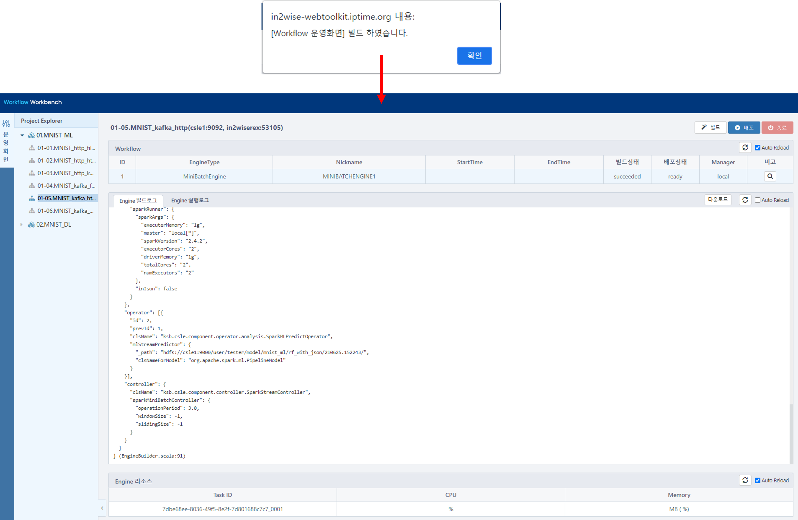
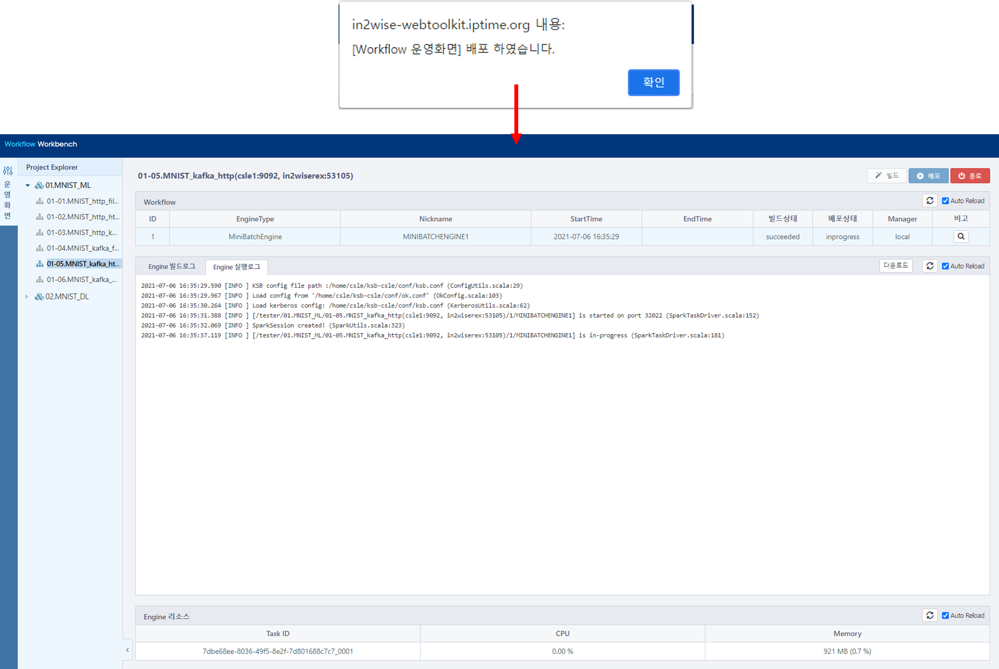
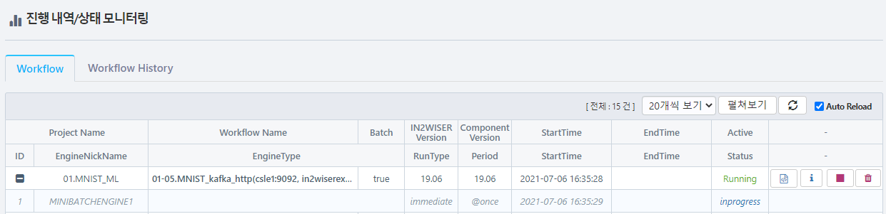
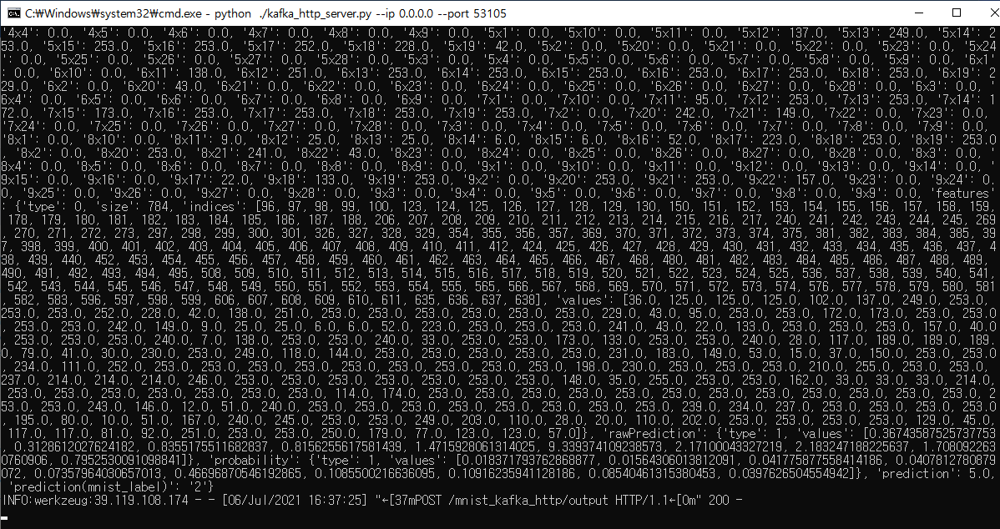

# kafka로 입력받아 HTTP 통신을 통해 결과 전달하기

해당 예제는 MNIST 모델을 이용한 이미지 예측입니다. 

입력으로 kafka를 이용하며, 워크플로우는 전달받은 데이터에 대한 예측 값을 HTTP 통신을 이용해 예제 서버에 전달합니다.

<br>

## 예제 서버(in2wiserex) 실행시키기

예제 파일 "http_http_server.py"를 실행시켜 결과 값을 받는 서버를 실행시킵니다.

<br>

## kafka topic 설정하기

| 속성             | 설정값            |
| ---------------- | ----------------- |
| bootStrapServers | csle1:9092        |
| zooKeeperConnect | csle1:2181        |
| groupId          | mnist_input_ml_05 |
| topic            | mnist_input_ml_05 |

<br>

## 워크플로우 빌드하기

IN2WISER 웹툴킷 상단 **Workbench** 의 **운영화면** 탭을 선택하여, **빌드**버튼을 선택합니다. **Engine 빌드로그** 에서 확인할 수 있습니다.



<br>

## 워크플로우 배포하기

IN2WISER 웹툴킷 상단 **Workbench**의 **운영화면** 탭을 선택하여 빌드를 진행했다면, **배포** 버튼을 선택하여, 워크플로우를 실행시킵니다.  **Engine 실행로그** 에서 확인할 수 있습니다.



<br>

## 워크플로우 모니터링하기

IN2WISER 웹툴킷 상단 **Monitoring** 탭에서 워크플로우의 진행 내역/상태를 확인할 수 있습니다.



<br>

## 워크플로우 종료하기

IN2WISER  웹툴킷 상단 **Monitoring** 에서 **Workflow** 탭을 선택하여, 현재 Status가 Inprogress인 01-05.MNIST_kafka_http(csle1:9092, in2wiserex:53105) 워크플로우의 정지버튼(<span style="color:red">&#9724;</span>)을 클릭하여 종료시킵니다.


<br>

## 결과 확인

## 예제 서버(in2wiserex) 실행시키기

예제 파일 "http_http_server.py"를 실행시켜 결과 값을 받는 서버를 실행시킵니다.

**실행방법**

```sh
python kafka_http_server.py --ip 0.0.0.0 --port 53105
```

<br>

##  입력 데이터 전달하기

예측하고자 하는 입력 데이터는 예제 파일 "kafka_producer.py"을 이용하여 워크플로우에 전달합니다. 해당 워크플로우 예제는 csle1:9092 의  mnist_input 토픽으로 데이터를 전달받습니다.

**실행방법**

```sh
python kafka_producer.py --ip csle1 --port 9092 --groupid mnist_input_ml_05 --topic mnist_input_ml_05
```

<br>

## 예제 서버에서 결과 값 확인하기

워크플로우를 실행시키고, 입력데이터가 전달되면, 예측 결과 값이 예제 서버(in2wiserex) 상에서 로그로 표시됩니다.

<br>

아래는 결과화면입니다.



<br>

<br>

<br>
