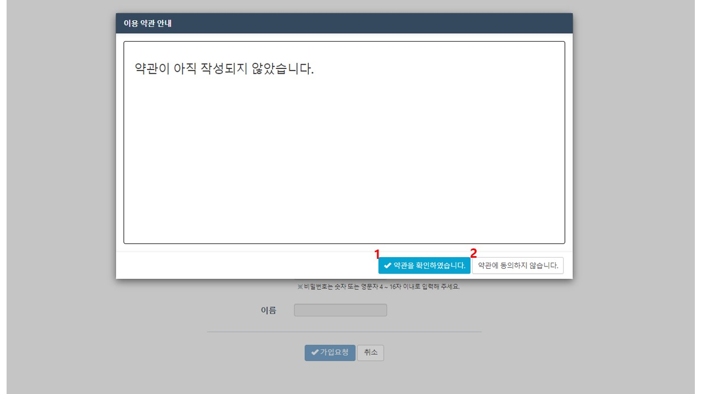
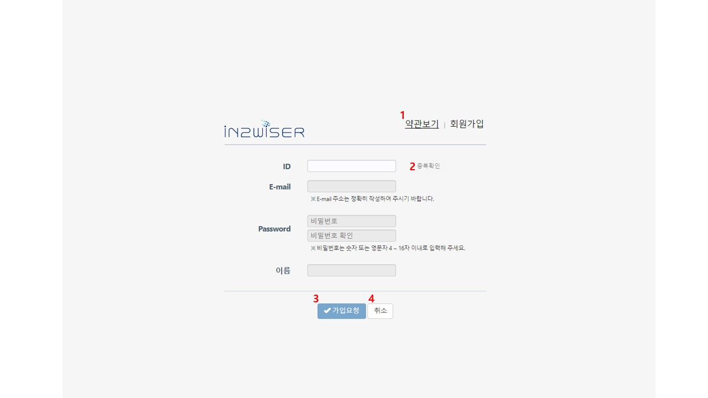
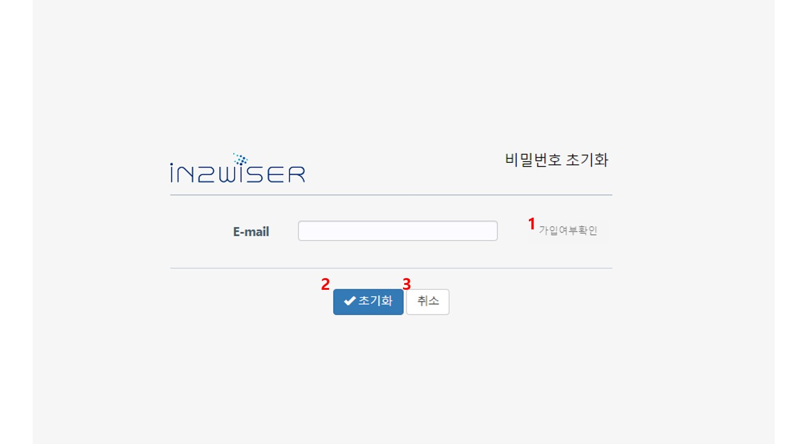

# 사용자

**IN2WISER WebToolkit**은 사용자가 프레임워크를 효과적으로 사용할 수 있도록 지원하는 웹기반의 저작 도구입니다. 워크플로우를 정의하고 실행하는 기능과 실행 과정을 모니터링하는 기능, 그리고 관련 데이터를 업로드하고 결과를 시각화하는 기능 등을 지원합니다. 회원가입을 통해 로그인을 하여 사용하며 사용자별로 워크플로우를 관리합니다.

 

## 로그인

1. 아이디, 패스워드 입력 후 **Login** 버튼을 입력하여 로그인합니다. 
2. 신규회원가입을 위한 버튼입니다. 
3. 비밀번호를 초기화하기 위한 버튼입니다.

 

## 회원가입

로그인 화면에서 <b>신규 회원가입</b> 버튼을 클릭하여 회원가입을 수행 합니다. 신규회원가입에 경우, 이용 약관 안내 팝업 창이 표출됩니다.

1. <b>약관을 확인하였습니다.</b> 버튼을 선택하면 회원 가입 절차를 진행할 수 있습니다.
2. <b>약관에 동의하지 않습니다.</b> 버튼을 선택하면 로그인 화면으로 돌아갑니다.

1. <b>약관보기</b> 를 선택하면 이용 약관 안내를 확인할 수 있습니다.

2. ID를 입력한 후, <b>중복확인</b>을 선택하여, ID 중복 여부를 확인합니다. 중복 시, 회원가입 절차가 진행되지 않습니다.

3. ID, E-mail, Password, 이름을 입력 후, <b>가입요청</b>을 이용해 가입을 완료합니다.

4. <b>취소</b>를 선택하면, 회원가입 절차가 취소되며, 로그인 화면으로 넘어갑니다.

가입요청 완료 후 (주)인투와이즈 담당자를 통해 가입 승인을 받으면 회원가입이 완료됩니다.

 

## 비밀번호 초기화

1. E-mail 입력 후, <b>가입여부확인</b>을 통해 E-mail 등록여부를 확인합니다. 
2. <b>초기화</b>를 선택하면, 등록된 E-mail로 초기화를 진행합니다.
3. <b>취소</b> 선택 시, 비밀번호 초기화  진행을 취소합니다.

 

## 사용자 정보

IN2WISER Webtoolkit 로그인 후 메인화면 우측 상단에 회원가입 시 입력한 이름, 회원 정보 수정 아이콘이 표출됩니다. 또한, 사용자 정보 아이콘 우측에는 로그아웃을 위한 아이콘이 존재하며, 필요에 따라 해당 아이콘을 통해 로그아웃을 진행할  수 있습니다.

1. 사용자 정보를 확인하는 버튼입니다. 
2. 로그아웃을 수행하는 버튼이며, 클릭 시 로그인 화면으로 전환됩니다.

### 사용자 정보 확인 / 수정하기

사용자 정보를 확인하는 버튼을 클릭하면, 아래와 같은 화면이 표출됩니다.

1. 비밀번호를 수정하는 버튼입니다. <b>비밀번호 수정</b> 버튼을 클릭하면, 비밀번호를 변경할 수 있으며, 아래 화면과 같이 현재 비밀번호, 새 비밀번호, 새 비밀번호 확인 입력 칸이 표출됩니다.

   

   1. **비밀번호 수정  취소** 버튼을 클릭하면, 현재 비밀번호, 새 비밀번호, 새 비밀번호 확인 입력 칸이 사라집니다.

   

2. 사용자 이름을 변경할 수 있습니다. 

4. 해당 사용자의 탈퇴를 진행하는 버튼입니다.

5. 변경된 내용을 수정 완료 하는 버튼입니다.

6. 변경 사항이 없을 경우, <b>닫기</b> 를 이용하여 창을 닫습니다.

### 탈퇴하기

사용자 정보 확인 / 수정에서 탈퇴 버튼을 클릭하면 탈퇴가 진행됩니다. <b>탈퇴</b> 버튼을 클릭하면 아래와 같은 화면이 표출됩니다. 

1. 탈퇴를 원할 경우, 사용자 비밀번호를 입력 칸에 입력하고 <b>확인</b> 버튼을 선택합니다. 탈퇴가 성공적으로 진행되면 아래와 같은 메시지가 표출되며 로그인 화면으로 전환됩니다.

   

2. <b>취소</b> 버튼을 이용해 탈퇴를 취소할 수 있습니다.

 

 

 
