# 모니터링

진행내역/상태 모니터링에서는 IN2WISER에서 실행한 워크플로우(워크플로우에 속한 엔진 포함)의 목록 및 상태를 확인할 수 있습니다. 또한 워크플로우 및 엔진의 Status에 따라 실행 중인 워크플로우 및 엔진을 종료하거나, 재실행할 수 있습니다. Workflow Histroy 탭에서 엔진이 실행 되어 생성된 결과파일을 확인하고 그래프로 시각화 하거나 로그 기록을 볼 수 있습니다. 

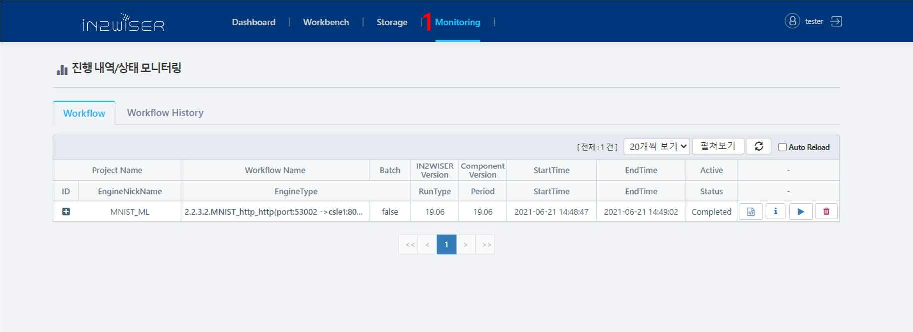

1. IN2WISER Webtoolkit 상단의 **Monitoring** 탭을 선택하면 위와 같은 화면이 표출됩니다.

 

## Workflow

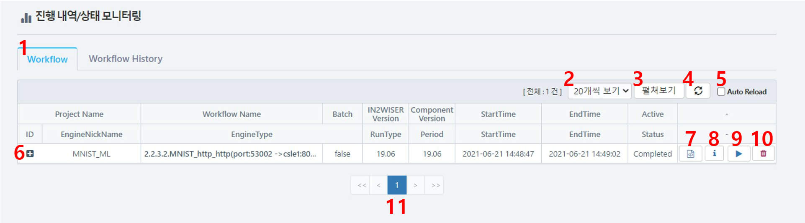

1. **Workflow** 탭을 선택하면 IN2WISER에서 실행한 워크플로우(워크플로우에 속한 엔진 포함)의 목록 및 상태를 확인할 수 있으며, 워크플로우에 대한 종료 및 재실행이 가능합니다.

2. **N개씩 보기**는 한 화면에 보여지는 워크플로우의 개수를 조절하는 기능이며, 10, 20, 30, 50 개씩 보기 중 선택 가능하고, 기본으로 "20개씩 보기"로 설정되어 있습니다. 아래는 **N개씩 보기**를 선택했을 때 설정할 수 있는 리스트를 보여주는 확면입니다.

   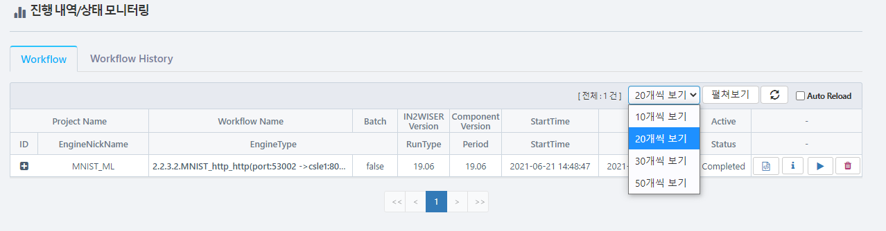

3. **펼쳐보기**는 화면에 보여지는 workflow에 속한 엔진들의 목록을 일괄적으로 보여주며, **줄여보기**는 펼쳐진 엔진들을 다시 숨기는 역할을 합니다. 아래는 **펼쳐보기**, **줄여보기**를 선택했을 때의 화면입니다.

   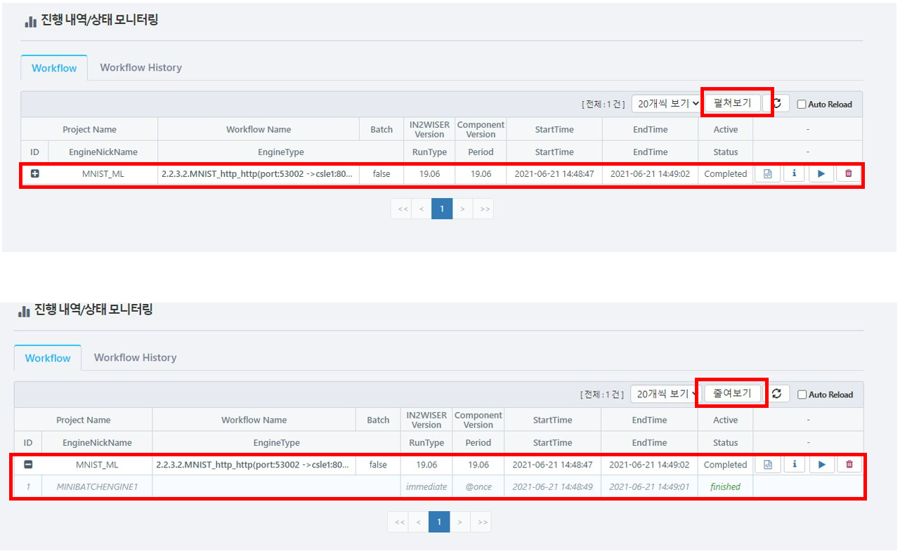

4. **새로고침**을 누르면 워크플로우 및 엔진 상태를 업데이트 합니다.

5. **Audo Reload**를 선택할 경우, 주기적으로 워크플로우 및 엔진의 상태가 업데이트 됩니다.

6. **+** 을 누르면 선택한 워크플로우에 대한 엔진 상태 및 정보들이 펼쳐져 보입니다. 아래 화면은 **+**를 선택했을 때 단일 워크플로우에 대한 세부 엔진이 표출되는 것을 보여줍니다.

   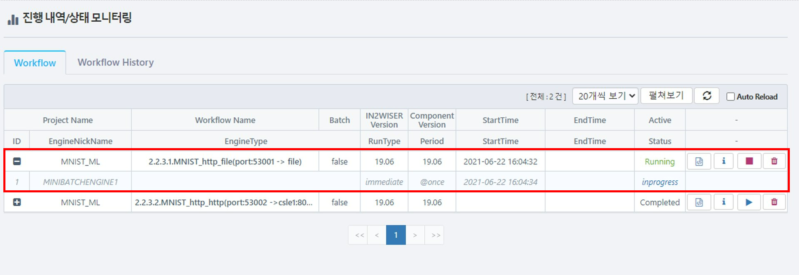

7. **세부 Spec보기**를 누르면 IN2WISER 편집기에서 작성한 워크플로우 스펙을 Json 행태로 표출해줍니다. 아래 화면은 **세부 Spec보기**를 눌렀을 때 표출되는 화면입니다.

   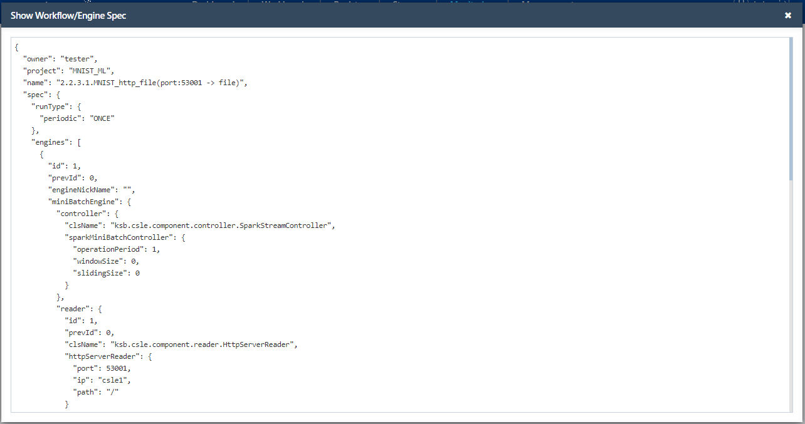

8. **Log 보기**를 누르면 해당 워크플로우의 빌드 로그와 실행 로그를 확인할 수 있습니다. 아래는 빌드 로그 및 실행 로그에 대한 화면입니다.

   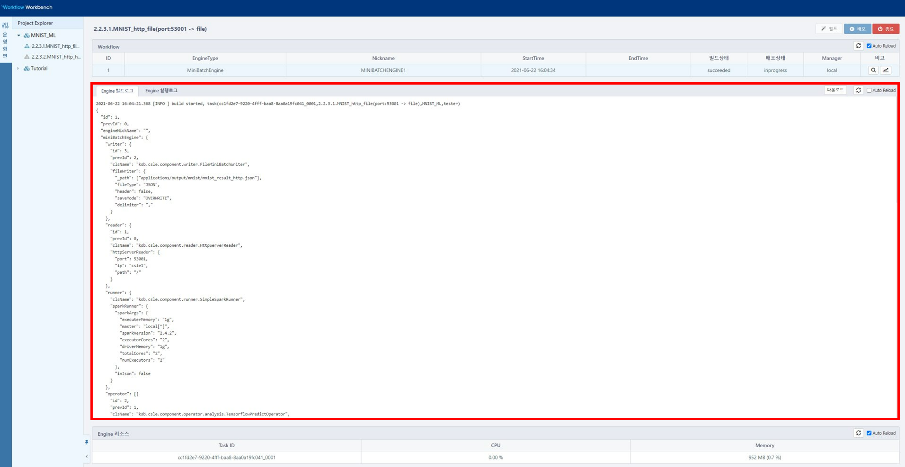

   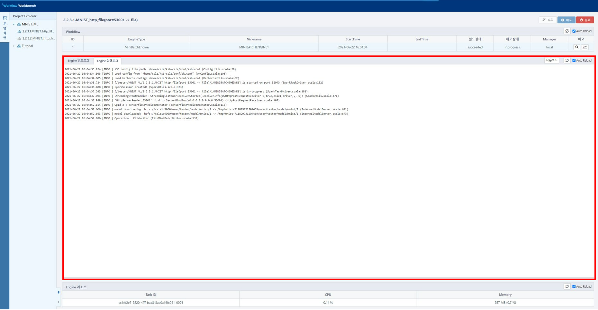

9. **Start** (▶)버튼을 누르면 "해당 Workflow를 배포 하시겠습니까?"라는 팝업이 뜨며, 확인 클릭 시 해당 워크플로우가 재실행합니다. 

   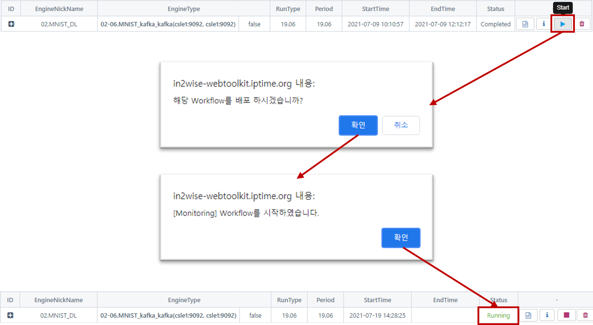

   **Stop** (■)버튼을 누르면 "해당 Workflow의 배포를 중지 하시겠습니까?"라는 팝업이 뜨며, 확인 클릭 시 해당 워크플로우가 종료됩니다.

   

10. **Workflow 삭제**버튼을 누르면 해당 워크플로우가 워크플로우 목록에서 제거됩니다. Monitoring에서의 Workflow 삭제는 빌드, 배포, 종료 정보를 삭제하는 행위로  Workbench 운영화면에서 워크플로우가 삭제되지 않습니다.

    

11. 워크플로우 목록 페이지 이동 버튼입니다.

 

## Workflow History

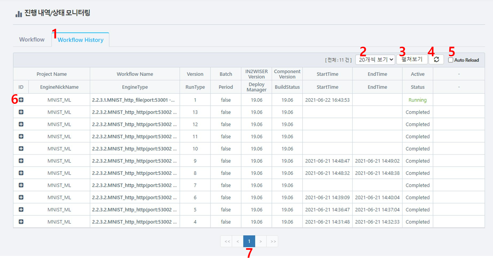

1. **Workflow History**텝을 선택하면 IN2WISER에서 실행했던 워크플로우에 대한 목록이 화면에 표출됩니다. 

2. **N개씩 보기**는 한 화면에 표출되는 워크플로우 목록을 의미하며, 10, 20, 30, 50개씩 보기가 선택 가능하고, 기본 설정 "20개씩 보기"입니다. 아래화면은 해당 버튼을 클릭했을 때의 표출 리스트 입니다.

   

3. **펼쳐보기**를 누르면 워크플로우 목록에 있는 워크플로우에 대하여 워크플로우 및 세부 엔진 목록까지 표출합니다. **줄여보기**는 펼쳐진 워크플로우 및 엔진 목록을 숨기는 기능입니다. 아래 화면은 **펼쳐보기**, **줄여보기**를 수행했을 때의 화면입니다.

   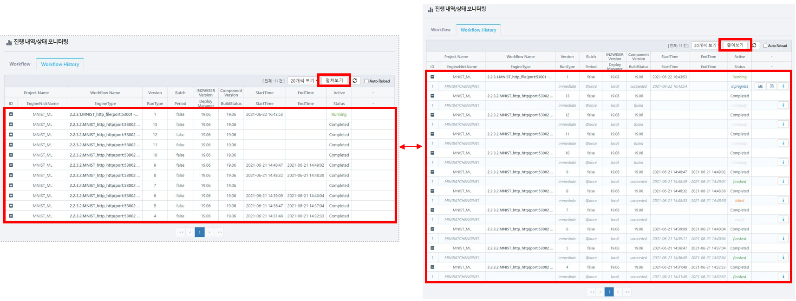

4. **새로고침**을 누르면 워크플로우 목록에 대하여 전체 새로고침을 진행합니다.

5. **Auto Reload**를 선택하면 주기적으로 워크플로우 목록을 갱신합니다.

6. **+**를 선택하면 선택된 워크플로우에 대한 워크플로우 및 세부 엔진 목록을 표출합니다. 아래 화면은 **+**를 눌렀을 때 표출되는 화면과 **-**를 눌렀을 때 접혀지는 화면입니다.

   

7. 워크플로우 히스토리 목록 페이지 이동 버튼입니다.

1. **결과 Chart 보기**는 선택한 워크플로우에 대한 결과를 보여줍니다. 워크플로우의 Writer가 FileWriter일 경우 활성화됩니다. 
2. **결과 미리 보기**는 선택한 워크플로우에 대한 결과를 보여줍니다. 워크플로우의 Writer가 FileWriter일 경우 활성화됩니다.  
3. **Show log**는 워크플로우를 빌드하고 실행한 엔진에 대한 로그를 보여줍니다. 

### 결과 Chart 보기

**결과 chart 보기**는 데이터를 확인하는 부분과  데이터에 대한 통계치를 확인하는 부분으로 나눌 수 있습니다. **결과 Chart 보기** 는 구분자로 데이터를 확인할 수 있는 파일일 때, 적합하게 보여줍니다.

1. **Data**를 선택하면 결과를 확인하고 하는 파일에 대한 데이터를 볼 수 있습니다. 
2. File list에서 파일을 선택하고 Separator, Header Included, Sampling을 설정하고 **OK**를 선택하여 보고자 하는 데이터를 표출할 수 있습니다.
3. 2.에서 설정한 값을 토대로 데이터가 표출되는 영역입니다.

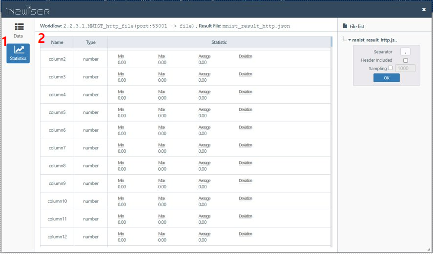

1. **Statistics**는 **Data**에서 설정(Separator, Header Included, Sampling)한 값을 토대로 통계치를 보여줍니다.
2. **Data**에서 설정(Separator, Header Included, Sampling)한 값을 토대로 데이터에 대한 통계치를 보여주는 영역입니다.

### 결과 미리 보기

**결과 미리 보기**는 워크플로우 실행 후, 생성된 결과를 보여주는 부분이며, text 로 표출합니다.

1. 표출하고자 하는 데이터의 최대 길이를 Max Length에 입력하고 **OK** 를 누르면 설정한 길이를 최대로 데이터를 출력합니다.
2. 1.에서 설정한 최대 길이로 데이터를 표출하는 영역입니다.

### 로그 보기

워크플로우를 빌드했을 때 로그와 배포해서 실행했을 때 출력된 로그를 보여줍니다.

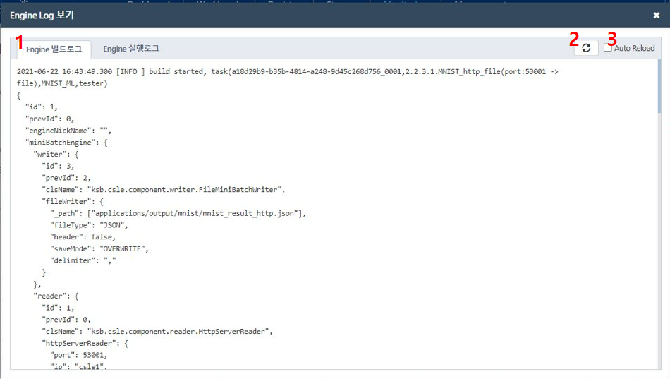

1. **Engine 빌드로그**를 선택하면 워크플로우 빌드 시 출력된 로그가 화면에 표출됩니다.
2. **새로고침**을 선택하면 빌드 로그가 새로고침됩니다.
3. **Auto Reload**를 선택하면 주기적으로 빌드 로그가 갱신됩니다.

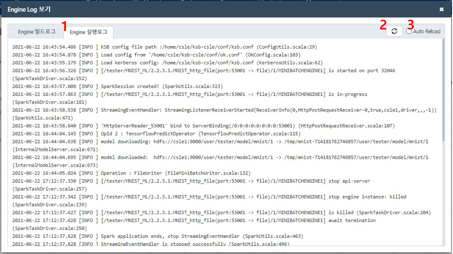

1. **Engine 실행로그**를 선택하면 워크플로우 실행 시 출력된 로그가 화면에 표출됩니다.
2. **새로고침**을 선택하면 실행 로그가 새로고침됩니다.
3. **Auto Reload**를 선택하면 주기적으로 실행 로그가 갱신됩니다.

 

 

 
