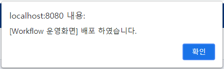

# 워크벤치

**Workbench**의 운영화면은 **IN2WISER Webtoolkit**에서 생성한 워크플로우를 안정적으로 운영하는 기능을 제공합니다. 

1. IN2WISER Webtoolkit 상단의 **Workbench** 탭을 선택하면 위와 같은 화면이 표출됩니다.

 

## 운영화면

1. **Project Explorer**에서 실행하고자 하는 워크플로우의 프로젝트 및 워크플로우를 선택합니다. (워크플로우를 더블클릭하여 정상적으로 선택되었을 시 워크플로우의 좌측 아이콘이 에서 으로 변경됩니다.)

2. **빌드** 버튼을 선택하여 워크플로우를 빌드합니다. **빌드** 버튼을 선택하면 아래와 같은 팝업 창이 뜹니다.

   

3. **배포** 버튼을 선택하여 빌드된 워크플로우를 실행합니다. **배포** 버튼을 선택하면 아래와 같은 팝업 창이 뜹니다.

   

4. **종료** 버튼을 선택하여 실행 중인 워크플로우를 종료합니다. **종료** 버튼을 선택하면 아래와 같은 팝업 창이 뜹니다.

   

5. **새로고침** 버튼을 이용하여 Workflow의 정보를 갱신합니다. 

6. **Auto Reload** 버튼을 이용하여 주기적으로 Workflow 의 정보를 갱신합니다.

7. **Engine 빌드로그** 탭은 **빌드** 버튼을 이용하여 워크플로우 빌드 시 출력되는 로그를 표출합니다. 아래는 워크플로우를 빌드하여 출력되는 로그 화면입니다. 빌드에 성공하면 "빌드상태"는 suceeded 가 되며, "배포상태"는 ready로 표출됩니다. 또한, Engine 리소스에 TaskID가 부여됩니다.

   

8. **Engine 실행로그** 탭은 **배포** 버튼을 이용하여 워크플로우 실행 시 출력되는 로그를 표출합니다. 아래는 워크플로우를 배포하여 출력되는 로그 화면입니다. 배포에 성공하여 워크플로우가 실행되면 "배포상태"가 inprogress로 표출되며, "Engine 리소스"에서 CPU, Memory 사용량이 표출됩니다.

   

9. **다운로드** 버튼은 **Engine 빌드로그** 탭 또는 **Engine 실행로그** 탭에 출력된 로그를 다운로드 합니다.

10. **새로고침** 버튼을 이용하여 **Engine 빌드로그** 탭 또는 **Engine 실행로그** 탭에 출력된 로그 정보를 갱신합니다.

11. **Auto Reload** 버튼을 이용하여 **Engine 빌드로그** 탭 또는 **Engine 실행로그** 탭에 출력된 로그를 주기적으로 갱신합니다.

12. **새로고침**을 이용하여 Engine 리소스 정보를 갱신합니다.

13. **Auto Reload** 버튼을 이용하여 주기적으로 Engine 리소스 정보를 갱신합니다.

14. **<** 를 이용하여 Project Explorer 사이드 창을 숨깁니다. 또한, **>** 를 이용하여 숨겨진 사이드 다시 창을 보이게 합니다. 아래는 **<**, **>** 를 선택했을 때 변화되는 화면을 보여줍니다.

    

 

## Workflow

1. **Engine Spec 보기** 는 워크플로우에 대한 세부 정보를 json 형태로 표출해주는 버튼입니다. 아래는 **Engine Spec 보기**를 선택했을 때, 표출되는 팝업 창입니다.

   

 

 

 
