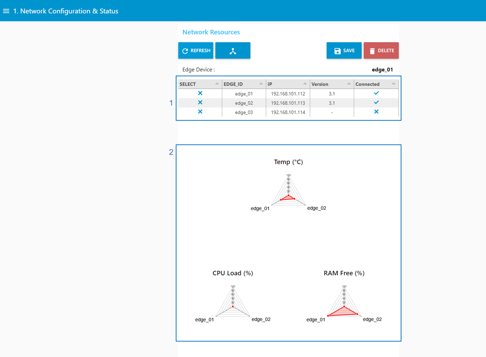
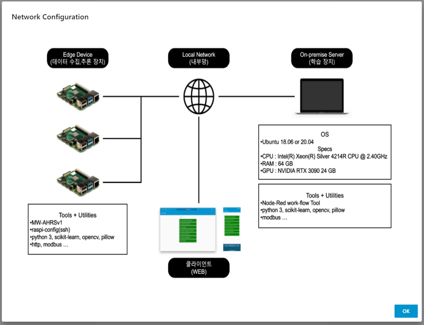
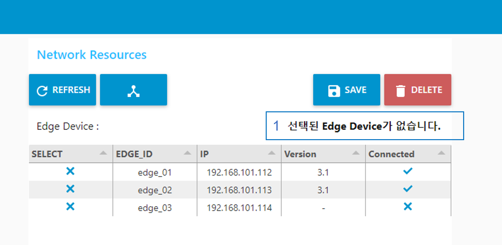

---

sort: 3

---

 
# Network Configuration & Status

연결된 엣지 디바이스에 대한 네트워크 설정과 상태 정보를 확인할 수 있다.

1. 엣지 디바이스에 대한 연결 정보를 나타내는 표이다.
    - SELECT : 엣지 디바이스 선택 여부
    - EDGE_ID : 엣지 디바이스 아이디
    - IP : 엣지 디바이스 IP
    - Version : 엣지 디바이스에 배포된 학습 모델 Version
    - Connected : 학습 장치에 대한 엣지 디바이스 연결 여부
    
 
2. 연결된 엣지 디바이스에 대한 상태정보(Temp, CPU, RAM)를 나타내는 그림이다.

 
 

1. REFRESH 버튼 : 연결된 엣지 디바이스에 대한 정보를 새로고침한다.
2. 공유 버튼 : 엣지 디바이스에 네트워크 환경 정보를 표현한 그림을 나타낸다. 아래는 선택했을 때, 표출되는 그림을 나타낸 것이다.

   

3. SAVE 버튼 : 선택한 엣지 디바이스를 저장한다. 
4. DELETE 버튼 : 엣지 디바이스 선택을 초기화한다.
5. SELECT box : 엣지 디바이스를 선택한다. (단, 하나의 엣지 디바이스만 선택 가능)
6. tab 버튼 : 왼쪽 사이드바를 이용해, 각 단계로 진입한다.

## 엣지 디바이스 선택

엣지 디바이스로부터 센서 데이터를 수집하고, 예측하기 위해서는 1.Network Configuration & Status 에서 엣지 디바이스를 선택해야 한다.

1. edge_01 의 SELECT box를 선택하고, SAVE 버튼을 누르면, "edge_01" 문구가 표출된다.

## 엣지 디바이스 선택  초기화

1. DELETE 버튼을 누르면, 선택된 엣지 디바이스가 초기화 되면서, "선택된 Edge Device가 없습니다." 문구가 표출된다.