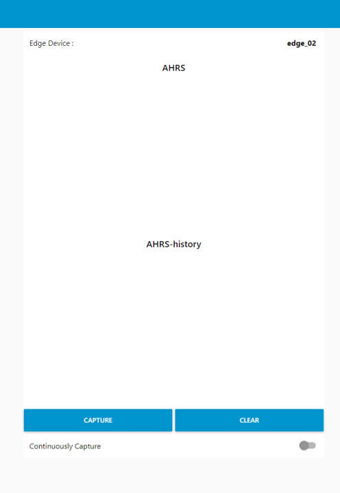
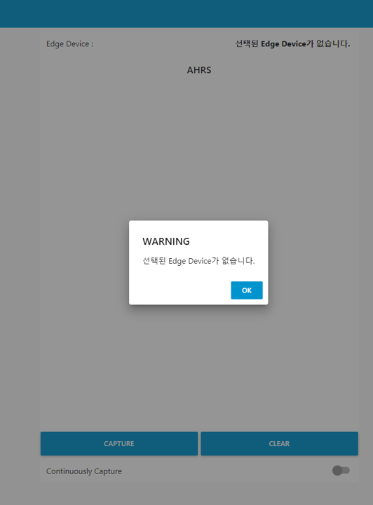
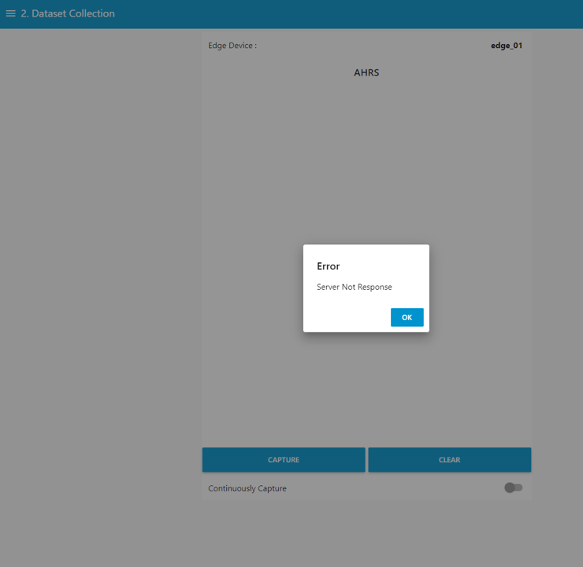

---

sort: 4

---

# Dataset Collection

---

연결된 엣지 디바이스로부터 데이터를 수집한다. 

1. 가장 최근에 수집한 데이터를 그래프로 나타내는 화면이다.
2. 최근에 수집한 데이터들을 그래프로 나타내는 화면이다.

  

1. CAPTURE 버튼 : 사용자가 해당 버튼을 이용해 데이터를 수집한다.
2. CLEAR 버튼 : 화면에 뿌려진 그래프를 초기화한다.
3. Continuously Capture 스위치 버튼 : 일정 간격으로 엣지 디바이스로부터 데이터를 수집한다.
4. tab 버튼 : 왼쪽 사이드바를 이용해, 각 단계로 진입한다.

  

## 데이터 수집

---

### [ 정상적인 엣지 디바이스를 선택한 경우 ]

capture 버튼 선택 시, 엣지 디바이스로부터 데이터가 수집되면서, 수집된 데이터 수치가 그래프로 표출된다.  

Continuously Capture 스위치 버튼을 활성화하면, 활성화 되어 있는 동안, 일정 시간마다 엣지 디바이스로부터 데이터를 수집하고, 그래프로 표출한다. 

clear 버튼을 선택하면, 화면에 표출되었던, 데이터 수치 그래프가 초기화된다. 

  

### [ 엣지 디바이스를 선택하지 않은 경우 ]

엣지 디바이스를 선택하지 않고, capture 버튼이나 Continuously Capture를 선택할 경우, "선택된 Edge Device가 없습니다." 라는 내용의 알림이 표출된다. 

  

### [ 비정상적인 엣지 디바이스를 선택한 경우 ]

비정상적인 엣지 디바이스를 선택하고, capture 버튼이나 Continuously Capture를 선택할 경우, "Server Not Response."라는 내용의 알림이 표출된다.  

