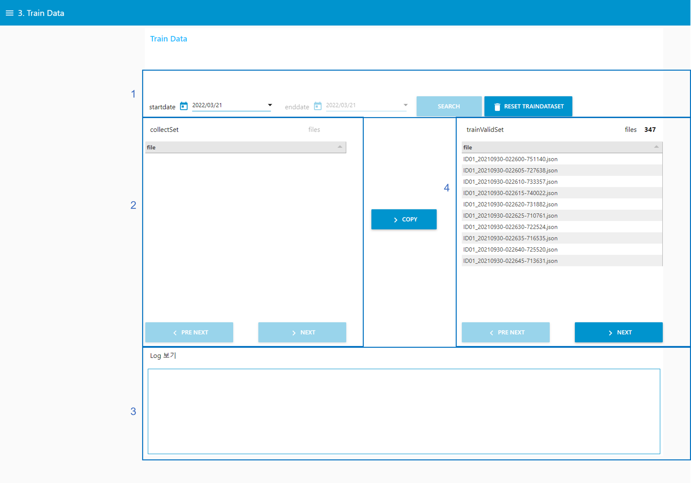
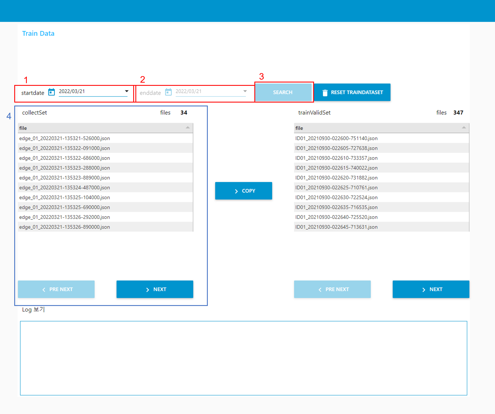

# Train Data
수집된 데이터는 날짜 기준으로 필터링하여, 훈련용 데이터셋으로 복사한다. 훈련용 데이터셋에 있는 데이터들은 모델을 학습하는데 사용된다.

1. 수집된 데이터에 대하여, 날짜 기반으로 필터링한다.
2. 선택된 날짜에 수집된 데이터가 리스트로 표출된다.
3. 수집된 데이터를 선택하여, 데이터 내용을 확인한다.
4. 훈련용 데이터 리스트를 표출한다.

## 날짜를 이용하여, 수집된 데이터 필터링

1. startdate : 훈련용 데이터로 쓰일 수집데이터의 시작 날짜를 선택한다. 
2. enddate : 훈련용 데이터로 쓰일 수집데이터의 마지막 날짜를 선택한다.
3. SEARCH 버튼 : startdate와 enddate 사이에 수집된 데이터를 4. collectSet 에 표출할 수 있도록 한다.

startdate 에서 선택한 날짜보다 enddate에서 선택한 날짜가 더 이른 경우, "enddate 는 startdate 보다 빠른 날짜를 선택할 수 없습니다." 문구를 포함한 알림을 표출한다.
## 수집된 데이터 내용 확인

1. collectSet에 표출된 데이터를 선택하면, Log보기를 통해, 내용을 확인할 수 있다.
## 훈련용 데이터로 복사

1. copy 버튼 : 날짜 선택 후, copy 버튼을 선택하면, collectSet에 있는 데이터를 trainValidSet에 복사하며, collectSet에 표출된 리스트는 초기화된다.
## 훈련용 데이터 초기화

1. RESET TRAINDATASET 버튼 : trainValidSet에 포함된 collectSet에서 복사해온 모든 데이터를 삭제한다.

