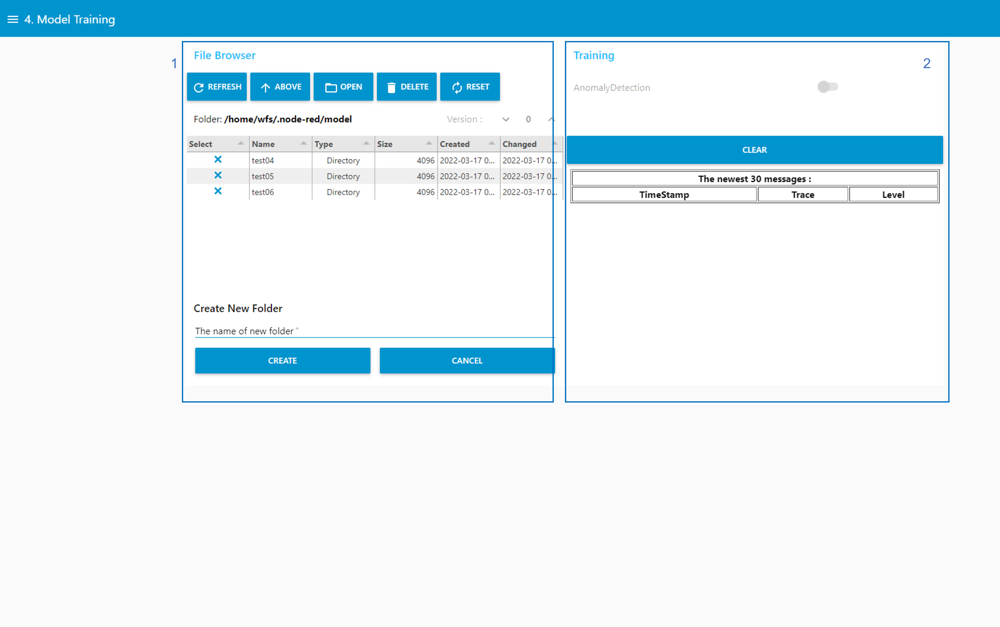
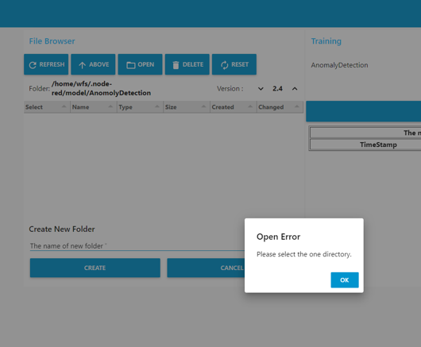
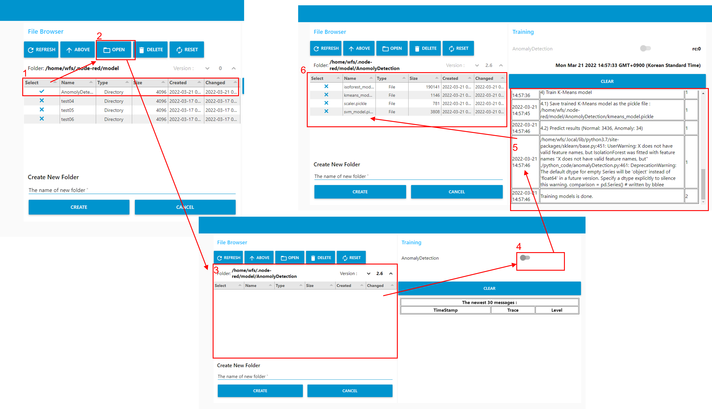

---

sort: 6

---

# Model Training

---

훈련용 데이터셋을 이용하여, 모델을 학습시킨다. 

1. 학습시킨 모델을 저장하기 위한 파일탐색기 영역이다. 
2. 훈련용 데이터셋을 이용하여, 모델을 학습시키는 과정을 나타내는 영역이다.

  

## 학습모델 저장을 위한 파일 탐색기 조작 기능

---

1. REFRESH 버튼 : 선택된 디렉토리들에 대하여, 선택 해제한다.
2. ABOVE 버튼 : 상위경로로 이동한다. "/home/wfs/.node-red/model" 경로까지 가능하다.
3. OPEN 버튼 : 하위경로로 이동한다. 만약 디렉토리를 선택하지 않을 경우, 아래와 같은 "Please select the one directory." 문구를 포함한 알림이 표출된다.

4. DELETE 버튼 : 선택된 디렉토리를 삭제한다. 아래 그림과 같은 알림 창이 뜨며, YES 선택 시, 선택된 디렉토리가 삭제된다.

5. RESET 버튼 : 초기 위치 "/home/wfs/.node-red/model" 로 이동한다.
6. CREATE 버튼 : Create New Folder 에 생성할 디렉토리 명을 입력하고, CREATE 버튼을 선택하면, 현재 위치에 디렉토리가 생성된다.
7. CANCEL 버튼 : Create New Folder 에 생성할 디렉토리 명을 입력하고, CANCEL 버튼을 선택하면, 작성된 디렉토리 명이 삭제된다.

  

## 훈련용 데이터를 이용한 모델 학습

---

훈련용 데이터를 이용해 모델을 학습시키기 위해서는 학습된 모델을 저장할 새로운 디렉토리를 생성하고, 모델 학습을 시작해야 한다. 아래 내용은 새로운 디렉토리를 생성했다는 가정하에 설명한다. 

1. 새로 생성한 디렉토리를 선택한다.
2. OPEN 버튼을 이용하여, 새로운 디렉토리의 하위경로로 이동한다. 
3. 경로를 확인하고, Version을 선택한다. Version은 설정된 버전 이상부터 가능하며, 더 낮은 버전을 선택할 경우 아래와 같은 "MAX Version:[Version정보]"문구를 포함한 알림을 표출한다. 

4. AnomalyDetection switch를 활성화하여, 모델 학습을 시작한다. 
5. 모델 학습 진행사항이 실시간으로 표출된다. 
6. 모델 학습이 완료되면, switch는 자동으로 비활성화되고, 학습된 모델들은 새로 생성한 디렉토리 내에 생성된다.

  

1. CLEAR 버튼 : 모델 학습으로 생성된 로그들을 지운다.
