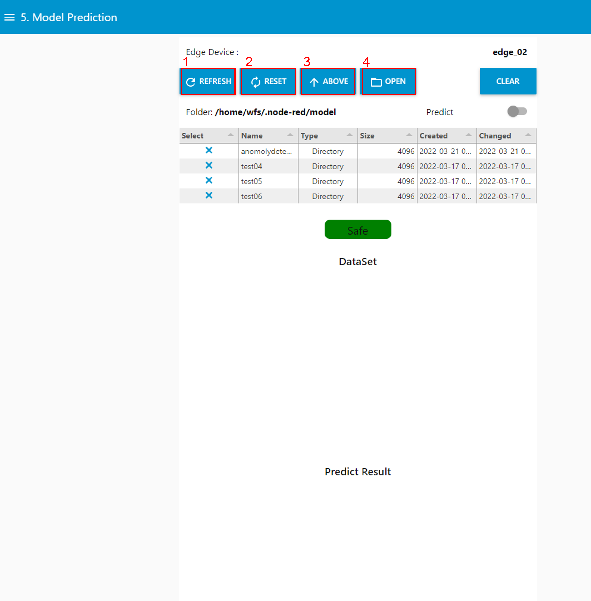
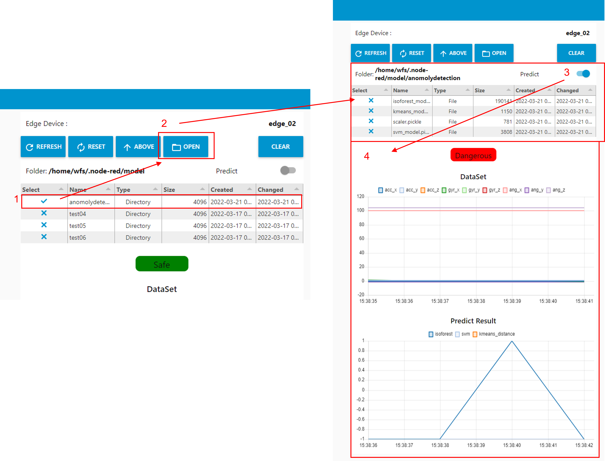
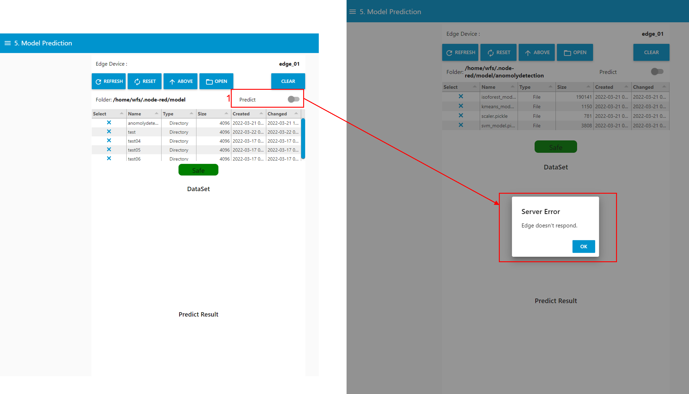

---

sort: 7

---

# Model Prediction

---

온프레미스 기반으로 모델을 시험한다. 

1. 예측을 수행할 학습 모델이 포함된 디렉토리를 선택하는 영역이다.
2. 선택된 모델을 이용해 엣지 디바이스에서 들어오는 실시간 데이터를 예측하여, 해당 결과를 표출해주는 영역이다.
- DataSet : 실시간으로 들어온 데이터 수치
- Predict Result : 들어온 데이터에 대한 예측 결과

  

## 파일 탐색기

---

실시간 데이터 예측을 수행할 학습모델이 있는 디렉토리 경로를 선택한다. 

1. REFRESH 버튼 : 선택된 디렉토리들에 대하여, 전체 선택해제한다. 
2. RESET 버튼 : 초기 상태 "/home/wfs/.node-red/model" 위치로 돌아간다. 
3. ABOVE 버튼 : 상위 디렉토리로 이동한다. "/home/wfs/.node-red/model" 경로까지 이동 가능하다. 
4. OPEN 버튼 : 선택한 디렉토리의 하위 경로로 이동한다.

  

## 학습모델을 이용한 데이터 예측

---

### [ 정상적인 엣지 디바이스를 선택한 경우 ]

학습모델이 있는 경로까지 이동한 후, Predict switch를 활성화하면, 일정시간으로 엣지 디바이스로부터 들어오는 데이터 수치와 해당 데이터에 대해 예측 결과를 표출한다. 

1. 실시간 데이터를 예측할 학습 모델 디렉토리르 선택한다.
2. 디렉토리를 선택하면서, 학습모델 파일이 존재하는 경로까지 이동한다.
3. Predict switch를 활성화 하여, 실시간으로 들어오는 데이터에 대한 예측을 수행한다. 
4. 들어온 데이터에 대한 수치와 예측 결과를 표출한다.

  

1. CLEAR 버튼 : 표출된 데이터 수치와 예측 결과를 초기화한다.

  

### [ 엣지 디바이스를 선택하지 않은 경우 ]

학습모델이 있는 경로까지 이동한 후, Predict switch를 활성화하면, 엣지 디바이스를 선택하지 않았기 때문에 경고 창이 뜨며, 예측을 진행하지 않는다. 

1. Predict switch를 활성화하면, "선택된 Edge Device가 없습니다." 문구를 포함하는 알림창이 표출된다.

  

### [ 비정상적인 엣지 디바이스를 선택한 경우 ]

학습모델이 있는 경로까지 이동한 후, Predict switch를 활성화하면, 비정상 엣지디바이스이기 때문에 에러 창이 뜨며, 예측을 진행하지 않는다. 

1. Predict switch를 활성화하면, "Edge doesn't response." 문구를 포함하는 에러창이 표출된다.

