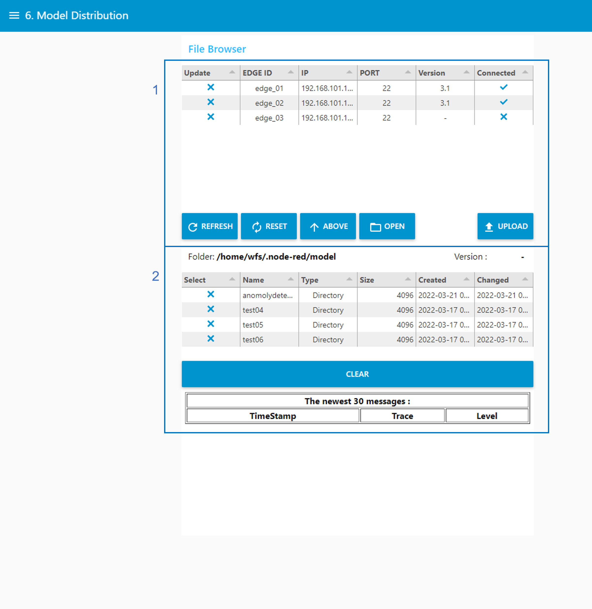

# Model Distribution
학습된 모델을 연결된 엣지 디바이스에 배포한다.

1. 엣지 디바이스에 대한 정보가 표출되어 있는 영역이다.
2. 학습모델 디렉토리를 조작할 수 있는 영역이다.
## 디렉토리 조작

1. REFRESH 버튼 : 선택된 디렉토리에 대하여, 선택해제 한다. 
2. RESET 버튼 : 초기 경로 "/home/wfs/.node-red/model"로 돌아간다.
3. ABOVE 버튼 : 상위 경로로 이동한다. "/home/wfs/.node-red/model"경로까지 이동 가능하다. 
4. OPEN 버튼 : 선택한 디렉토리 하위 경로로 이동한다.
## 엣지 디바이스에 학습모델 배포

1. 엣지 디바이스에 배포할 학습모델 디렉토리를 선택한다.
2. OPEN 버튼을 선택하여, 배포한 학습모델 파일이 있는 경로까지 이동한다. 
3. 학습모델을 배포할 엣지 디바이스를 선택한다. (다중 선택 가능)
4. UPLOAD 버튼을 선택하여, 선택한 학습모델을 선택한 엣지 디바이스에 배포한다. 배포 시, 배포과정이 로그로 표출되며, 배포가 정상적으로 완료되면, 엣지 디바이스의 Version 정보가 배포한 학습모델 Version으로 변경된 것을 확인할 수 있다.

1. CLEAR 버튼 : 출력된 로그 정보를 삭제한다.