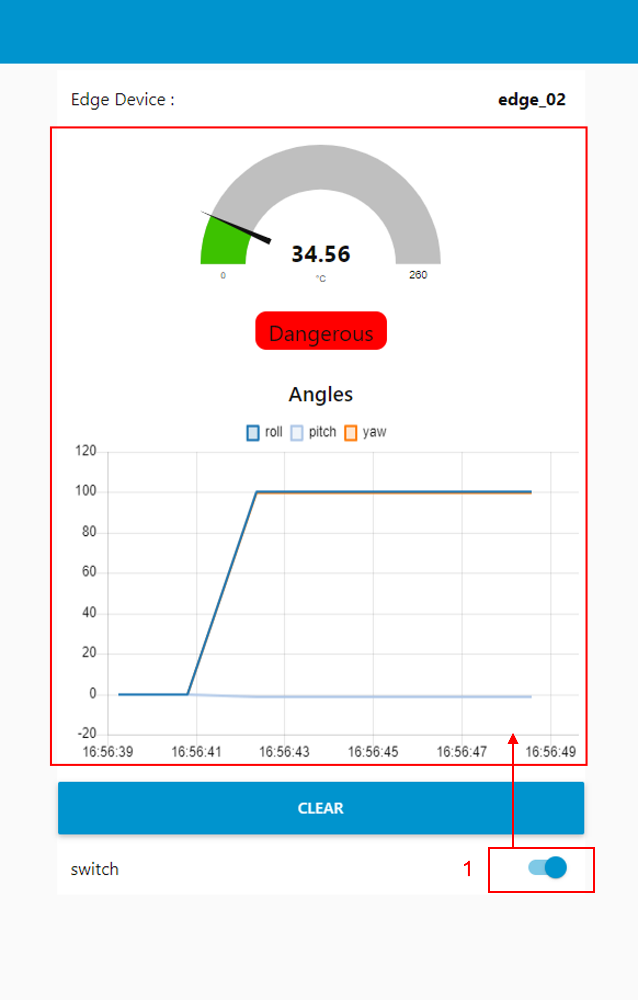

---

sort: 9

---

# Pilot Test
엣지 디바이스에 배포한 학습모델을 기반으로 센서 데이터를 예측한다.

1. 예측 결과를 나타내는 영역이다.
2. 들어오은 센서 데이터 수치를 표출하는 영역이다.

## 엣지 디바이스에서 배포한 학습모델로 센서 데이터 예측하기 

1. switch 버튼을 활성화하면, 엣지 디바이스에 배포된 학습모델을 이용하여, 센서 데이터를 예측한다.

2. CLEAR 버튼 : 예측 수치를 삭제한다.